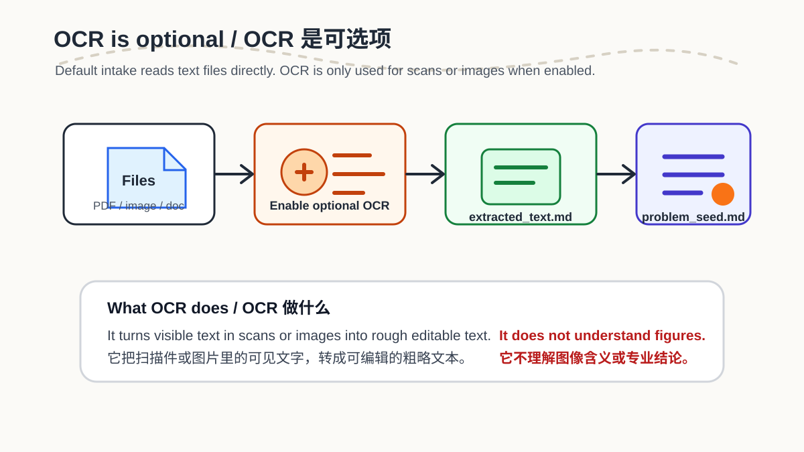
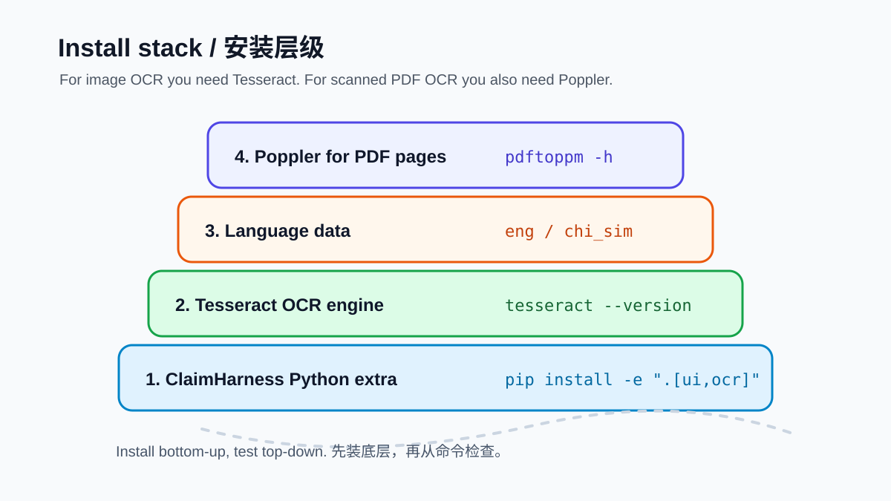
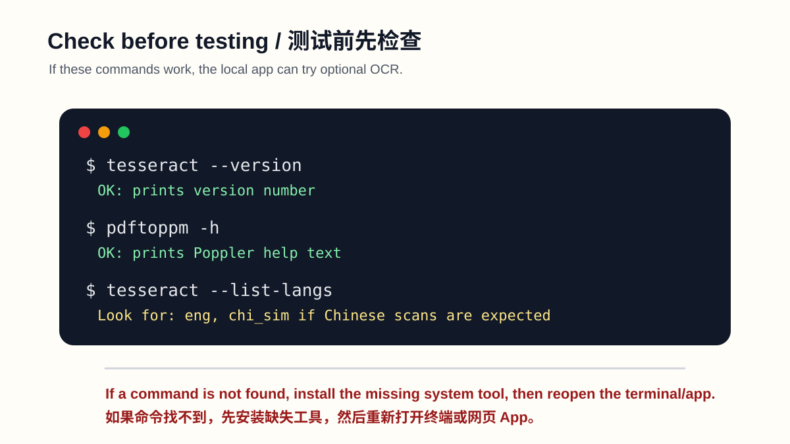

# OCR Setup Guide

OCR is optional. ClaimHarness and ProblemBridge can run without it. Install OCR only when you want to read scanned PDFs or image files in the Document Intake page.



## What OCR Adds

Without OCR, Document Intake can already read text-based PDF, Word, Markdown, TXT, CSV, HTML, public static webpages, and basic document annotations.

With OCR enabled, Document Intake can also try to extract rough text from:

- scanned PDFs
- `.png`, `.jpg`, `.jpeg`, `.tif`, `.tiff`, and `.bmp` files

OCR does not understand images, charts, figures, handwriting intent, or professional meaning. It only turns visible printed text into rough editable text.

The default local gate limits a source to 25 MB, 50 pages, and 1,000,000 extracted characters. Each OCR/PDF-render operation has a 30-second timeout; PDF pages render at 150 DPI and pages above 20,000,000 pixels are rejected. These bounds reduce resource risk but do not guarantee accurate extraction or make untrusted files safe.

Mixed text/scanned PDFs are deliberately not auto-merged. If at least one page has direct text and another page has no extractable text, Document Intake keeps the direct text, reports the exact no-text page numbers, and requires page-level source review. With OCR enabled, the OCR report fails closed with `mixed_pdf_requires_page_review`; OCR is not run on only the blank-looking pages because the tool cannot prove whether they are scans, intentional blanks, or safely aligned with extracted text. Split confirmed scanned pages into a separate image-only PDF or image files before running reviewed OCR.

## Install the Python OCR Extra

From the repository root:

```bash
pip install -c requirements/constraints.txt -e ".[ui,ocr]"
```

If you already installed the project, running the same command again is fine. It adds the optional Python packages used by OCR:

- `pytesseract`
- `pdf2image`
- `Pillow`



## Install System OCR Tools

The Python packages are not enough by themselves. OCR also needs system tools.

### Windows

1. Install Tesseract OCR from the UB-Mannheim Windows installer:
   <https://github.com/UB-Mannheim/tesseract/wiki>

2. During installation, keep the default folder when possible:

```text
C:\Program Files\Tesseract-OCR
```

3. Make sure this folder is on the Windows `PATH`.

4. For scanned PDF OCR, install Poppler for Windows and add its `bin` folder to `PATH`.
   The `pdf2image` project links to the current Windows Poppler package:
   <https://pdf2image.readthedocs.io/en/latest/installation.html#installing-poppler>

5. Reopen PowerShell or restart the local web app.

### macOS

If Homebrew is installed:

```bash
brew install tesseract poppler
```

Then reinstall or update the Python OCR extra:

```bash
pip install -c requirements/constraints.txt -e ".[ui,ocr]"
```

### Ubuntu / Debian

```bash
sudo apt update
sudo apt install tesseract-ocr poppler-utils
pip install -c requirements/constraints.txt -e ".[ui,ocr]"
```

For Chinese scans, also install Simplified Chinese language data:

```bash
sudo apt install tesseract-ocr-chi-sim
```

## Chinese OCR

For Chinese scanned documents, Tesseract needs the `chi_sim` language data. Check it with:

```bash
tesseract --list-langs
```

Look for:

```text
eng
chi_sim
```

If `chi_sim` is missing:

- Windows: rerun the UB-Mannheim installer and include Chinese language data, or copy `chi_sim.traineddata` into the `tessdata` folder.
- macOS: use Homebrew Tesseract language packages if available, or install the traineddata file manually into Tesseract's `tessdata` folder.
- Ubuntu / Debian: run `sudo apt install tesseract-ocr-chi-sim`.

Installing `chi_sim` only enables rough Chinese character recognition. It does not mean ClaimHarness claim extraction or verification has been validated for Chinese manuscripts; the current audit rules and synthetic regression set are English-first.

## Check Installation

Open a new terminal after installation and run:

```bash
tesseract --version
pdftoppm -h
tesseract --list-langs
```

Expected:

- `tesseract --version` prints a version number.
- `pdftoppm -h` prints Poppler help text.
- `tesseract --list-langs` includes `eng`; include `chi_sim` for Chinese scans.



## Use OCR in the Local App

1. Start the local UI:

```bash
streamlit run apps/problem_bridge_wizard.py
```

2. Open **Document intake**.
3. Upload a scanned PDF or image file.
4. Turn on **Enable optional OCR for images and image-only PDFs**.
5. Choose **OCR language**: `eng`, `chi_sim`, or `eng+chi_sim`. The selected Tesseract language packs must be installed locally. English UI defaults to `eng`; Chinese UI defaults to `eng+chi_sim`. This is a default, not automatic language detection.
6. Click **Generate document intake package**.

The extracted OCR text appears in:

- `extracted_text.md`
- `problem_seed.md`
- `ocr_quality_report.json`
- the downloadable output zip (original uploads remain excluded unless explicitly selected)

Review `ocr_quality_report.json` for the engine/version, requested language, source SHA-256, per-page locators and character counts, unavailable-confidence notes, failed/skipped pages, truncation, and byte/page/character/timeout/DPI/pixel-limit warnings. OCR text is marked `derived_text/ocr` and cannot satisfy strong-evidence or human-approval rules by default. If ClaimHarness extracts a claim from derived input, it routes that claim to `needs_human_review` with original-source inspection still required.

## Troubleshooting

| Symptom | Likely Cause | Fix |
| --- | --- | --- |
| `tesseract` is not recognized | Tesseract is not installed or not on `PATH` | Install Tesseract, add it to `PATH`, then reopen terminal/app |
| `pdftoppm` is not recognized | Poppler is missing or not on `PATH` | Install Poppler and add `bin` to `PATH` |
| English works but Chinese is poor | `chi_sim` language data is missing | Install `chi_sim` traineddata |
| Mixed PDF reports `mixed_pdf_requires_page_review` | Some pages have direct text while other pages have no text layer | Inspect the listed pages; split confirmed scans into a separate scan-only PDF/images, then OCR and review them separately |
| OCR returns messy text | Scan quality is low or layout is complex | Use clearer scans, crop margins, or treat OCR as rough intake only |
| OCR option is off | OCR is disabled by default | Enable optional OCR in Document Intake |

## Safety Boundary

OCR is only a text extraction aid. It does not verify claims, interpret charts, identify clinical meaning, or replace professional review. Always compare extracted text with the original before using it for ProblemBridge or ClaimHarness; an OCR-origin “review” note is not independent human approval.

## Sources

- Tesseract installation documentation: <https://tesseract-ocr.github.io/tessdoc/Installation.html>
- UB-Mannheim Windows installer: <https://github.com/UB-Mannheim/tesseract/wiki>
- pdf2image Poppler installation notes: <https://pdf2image.readthedocs.io/en/latest/installation.html>
- Homebrew: <https://brew.sh/>
