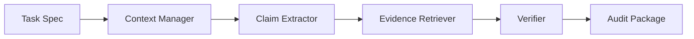

# ClaimHarness: A Lightweight Agent Harness for Scientific Claim-Evidence Auditing

ClaimHarness turns a scientific manuscript into an auditable claim-evidence package. Given a Markdown manuscript, CSV result tables, and references, it extracts scientific claims, retrieves possible evidence, verifies support levels, routes risky claims for human review, and writes a replayable audit trace.

This is not a prompt-only reviewer. It decomposes the task into task specification, context selection, claim extraction, evidence retrieval, verification, human-review routing, and trace logging.

Run the bundled synthetic demo and generate the browser report in one command:

```bash
.venv\Scripts\python.exe -m claim_harness demo
```

The project is checked by GitHub Actions CI on push and pull request.

## Architecture



The mock pipeline is deterministic and local-first. It does not require an API key.

## Quickstart

Create and install the development environment:

```bash
python -m venv .venv
.venv\Scripts\python.exe -m pip install -e ".[dev]"
```

Run the synthetic oocyte demo manually:

```bash
.venv\Scripts\python.exe -m claim_harness run \
  --manuscript examples/oocyte_demo/manuscript.md \
  --tables examples/oocyte_demo/tables \
  --references examples/oocyte_demo/references.md \
  --out outputs/oocyte_demo_run \
  --llm mock
```

Run tests:

```bash
.venv\Scripts\python.exe -m pytest
```

Or use the one-command demo path:

```bash
.venv\Scripts\python.exe -m claim_harness demo --out outputs/oocyte_demo_run
```

## Optional OpenAI-Compatible Provider

The default demo uses `--llm mock` and never needs an API key. To request an additional advisory LLM review, set environment variables and choose `openai-compatible`:

```powershell
$env:OPENAI_API_KEY = Read-Host "OPENAI_API_KEY"
$env:OPENAI_MODEL="gpt-5.4-mini"
.venv\Scripts\python.exe -m claim_harness run `
  --manuscript examples/oocyte_demo/manuscript.md `
  --tables examples/oocyte_demo/tables `
  --references examples/oocyte_demo/references.md `
  --out outputs/oocyte_demo_openai `
  --llm openai-compatible
```

`OPENAI_BASE_URL` is optional and defaults to `https://api.openai.com/v1`. The provider writes `llm_review.json` as an advisory artifact; it does not replace deterministic verification or human review.

## Static Report Viewer

Generate a local HTML viewer for an existing audit package:

```bash
.venv\Scripts\python.exe -m claim_harness view --run outputs/oocyte_demo_run
```

This writes `outputs/oocyte_demo_run/index.html`, a static report viewer that can be opened directly in a browser. It does not run a server or change audit results.

## Demo Input Structure

```text
examples/oocyte_demo/
  manuscript.md
  references.md
  tables/
    table1_metrics.csv
    table2_ablation.csv
```

The manuscript is fully synthetic and describes a human-in-the-loop, explainable workflow for oocyte injection guidance. The tables are toy result tables designed to exercise claim extraction, evidence retrieval, and verification logic.

## Expected Output

The mock demo writes five files:

```text
outputs/oocyte_demo_run/
  claim_table.csv
  evidence_map.json
  audit_report.md
  revision_suggestions.md
  agent_trace.jsonl
  index.html
```

`claim_table.csv` contains one row per claim:

```text
claim_id,source_line,status,claim_type,example
C002,4,supported,performance_claim,The proposed harness improves segmentation Dice and IoU...
C004,4,overclaimed,clinical_claim,Although the prototype is not clinically validated...
C007,8,weakly_supported,novelty_claim,The first design goal is to make every guidance claim traceable...
```

`source_line` points back to the approximate manuscript line. `evidence_map.json` links claim IDs to evidence IDs and includes a match reason for each link so reviewers can inspect why a claim was classified. `agent_trace.jsonl` records each pipeline step in order, including loading, extraction, retrieval, verification, and report generation.

## Why this is an Agent Harness

ClaimHarness is designed as a small harness around an AI-assisted scientific review task, not as a monolithic agent. It exposes:

- task specification
- context selection
- tool and data access
- intermediate state tracking
- verification
- human-review routing
- replayable audit log

The goal is not to replace reviewers. The goal is to make scientific claims more traceable, reviewable, and evidence-aware before they enter higher-risk workflows.

## Current Status

Implemented:

- CLI-first mock audit pipeline
- synthetic oocyte demo inputs
- Pydantic schemas
- Markdown and CSV loaders
- deterministic claim extraction
- deterministic evidence retrieval
- source_line and match reason traceability
- conservative mock verification
- optional OpenAI-compatible advisory review
- static report viewer
- GitHub Actions CI
- CSV, JSON, Markdown, and JSONL outputs

Planned or optional:

- richer prompt templates
- PDF and figure-aware evidence ingestion

## Limitations

- ClaimHarness does not guarantee factual correctness.
- It only checks evidence available in the provided files.
- Biomedical claims require human review.
- Mock mode is deterministic and not semantically complete.
- PDF and figure understanding are future work.

See [docs/architecture.md](docs/architecture.md), [docs/demo_walkthrough.md](docs/demo_walkthrough.md), and [docs/limitations.md](docs/limitations.md) for more detail.
