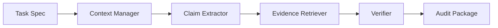

# ClaimHarness + ProblemBridge

ClaimHarness: A Lightweight Agent Harness for Scientific Claim-Evidence Auditing

ClaimHarness turns a scientific manuscript into an auditable claim-evidence package. Given a Markdown manuscript, CSV result tables, and references, it extracts scientific claims, retrieves possible evidence, verifies support levels, routes risky claims for human review, and writes a replayable audit trace.

This is not a prompt-only reviewer. It decomposes the task into task specification, context selection, claim extraction, evidence retrieval, verification, human-review routing, and trace logging.

ProblemBridge is the upstream sister module: a workflow discovery and problem alignment harness for interdisciplinary AI projects. It turns a domain problem brief into a Problem Alignment Package: workflow map, pain point matrix, concept alignment table, AI task spec, evidence contract, evaluation protocol, misalignment risk report, human-in-the-loop plan, implementation routes, and trace log.

ProblemBridge aligns the problem before AI work begins; ClaimHarness audits the claims after AI or human work produces outputs.

The relationship is:

```text
ProblemBridge: domain workflow -> aligned AI task specification
ClaimHarness: scientific claim -> evidence audit
```

ProblemBridge is not STORM, RAG, or a writing assistant. STORM-like systems help explore what a topic should cover; ProblemBridge asks whether the proposed AI task remains faithful to the source-domain workflow, evidence standards, evaluation goals, and human decision boundaries.

Run the bundled synthetic demo and generate the browser report in one command:

```bash
.venv\Scripts\python.exe -m claim_harness demo
```

Run the bundled ProblemBridge HSG alignment demo:

```bash
.venv\Scripts\python.exe -m problem_bridge demo
```

The project is checked by GitHub Actions CI on push and pull request.

## Architecture



The mock pipeline is deterministic and local-first. It does not require an API key.

## Quickstart

Create and install the development environment:

```bash
python -m venv .venv
.venv\Scripts\python.exe -m pip install -e ".[dev]"
```

Run the synthetic oocyte demo manually:

```bash
.venv\Scripts\python.exe -m claim_harness run \
  --manuscript examples/oocyte_demo/manuscript.md \
  --tables examples/oocyte_demo/tables \
  --references examples/oocyte_demo/references.md \
  --out outputs/oocyte_demo_run \
  --llm mock
```

Run tests:

```bash
.venv\Scripts\python.exe -m pytest
```

Or use the one-command demo path:

```bash
.venv\Scripts\python.exe -m claim_harness demo --out outputs/oocyte_demo_run
```

## For non-AI users

If you mainly want to test whether ProblemBridge can help describe a workflow, start with the guided UI instead of the CLI.

Clone the repository and enter the project folder:

```powershell
git clone https://github.com/RubyYii/ClaimHarness.git
cd ClaimHarness
```

Run the Windows helper script:

```powershell
.\scripts\run_problembridge_ui_powershell.ps1
```

Or double-click:

```text
scripts/run_problembridge_ui_windows.bat
```

When the browser opens:

1. Start with `Explore examples`.
2. Generate one synthetic example.
3. Read the friendly summary before opening the technical files.
4. Use `Domain practitioner wizard` to describe a repeated workflow, not an AI task.
5. Download the package for an AI engineer only after checking that it contains no private material.

Start with synthetic examples. Do not upload private patient data, confidential manuscripts, API keys, or sensitive unpublished materials.

## Downloadable local web app package

For external testing, the repository can be shared as a local web app package:

```text
ProblemBridge-ClaimHarness-v0.3.2-local-webapp.zip
```

After downloading:

1. Unzip the package.
2. Double-click `RUN_PROBLEMBRIDGE_WINDOWS.bat`.
3. Wait while the first run creates `.venv` and installs dependencies.
4. Use the browser UI that opens locally.
5. Start with `Explore examples`.
6. Then try `Domain practitioner wizard` with a non-sensitive workflow.

This is not an online service and not a standalone `.exe`. It runs locally through Python and Streamlit. Do not upload sensitive data, private patient data, confidential manuscripts, API keys, or unpublished project materials.

If the Windows launcher does not load:

1. Make sure Python 3.10 or newer is installed.
2. Re-run from a terminal so the error remains visible:

```powershell
.\RUN_PROBLEMBRIDGE_WINDOWS.bat
```

3. If the browser does not open automatically, visit:

```text
http://127.0.0.1:8501
```

Static HTML is best for viewing examples only. It does not run the workflow wizard, generate new alignment packages, or run ClaimHarness.

To build the package from a checked-out repository:

```powershell
.\scripts\build_release_zip_powershell.ps1
```

If PowerShell blocks local scripts, use:

```powershell
powershell -ExecutionPolicy Bypass -File scripts\build_release_zip_powershell.ps1
```

To test the zip before sharing:

```powershell
.\scripts\test_release_zip_powershell.ps1
```

Or:

```powershell
powershell -ExecutionPolicy Bypass -File scripts\test_release_zip_powershell.ps1
```

## ProblemBridge Quickstart

Run the synthetic HSG alignment demo:

```bash
.venv\Scripts\python.exe -m problem_bridge demo --out outputs/problem_bridge_hsg_demo
```

Run a specific problem brief:

```bash
.venv\Scripts\python.exe -m problem_bridge align `
  --brief examples/problem_bridge/hsg/problem.md `
  --out outputs/hsg_alignment `
  --llm mock
```

The mock alignment package writes:

```text
outputs/hsg_alignment/
  problem_card.md
  workflow_map.md
  painpoint_opportunity_matrix.csv
  concept_alignment_table.csv
  ai_task_spec.yaml
  evidence_contract.yaml
  evaluation_protocol.md
  misalignment_risk_report.md
  human_in_loop_plan.md
  implementation_routes.md
  alignment_trace.jsonl
```

Bundled synthetic ProblemBridge examples:

```text
examples/problem_bridge/
  hsg/problem.md
  chinese_painting/problem.md
  political_education/problem.md
```

ProblemBridge should be used before model building, when the key question is whether a domain workflow has been turned into the right AI task. ClaimHarness should be used after claims or reports exist, when the key question is whether those claims are supported by evidence.

## Guided UI for non-AI users

ProblemBridge also includes an optional local guided UI for people who do not already know how to describe an AI task. It starts from repeated work, workflow steps, judgement materials, pain points, human-review boundaries, and useful assistant outputs. The UI then generates the same Problem Alignment Package used by the CLI.

Install the optional UI dependencies:

```powershell
.venv\Scripts\python.exe -m pip install -e ".[dev,ui]"
```

Run the local Streamlit wizard:

```powershell
.venv\Scripts\python.exe -m streamlit run apps/problem_bridge_wizard.py
```

The wizard includes:

- Explore examples
- Domain practitioner wizard
- AI practitioner wizard
- Friendly output cards
- Advanced technical file view
- Downloadable alignment package

Do not upload private patient data, confidential manuscripts, API keys, or sensitive unpublished materials.

## Optional OpenAI-Compatible Provider

The default demo uses `--llm mock` and never needs an API key. Remote providers are optional and advisory only. Supported provider names include:

```text
mock
openai
openai-compatible
deepseek
groq
mistral
openrouter
xai
ollama
gemini
anthropic
```

Use `mock` for first-round usability testing. Use remote providers only when you are comfortable sending the current inputs to that external service.

For OpenAI or a generic OpenAI-compatible endpoint, set environment variables and choose `openai-compatible`:

```powershell
$env:OPENAI_API_KEY = Read-Host "OPENAI_API_KEY"
$env:OPENAI_MODEL="gpt-5.4-mini"
.venv\Scripts\python.exe -m claim_harness run `
  --manuscript examples/oocyte_demo/manuscript.md `
  --tables examples/oocyte_demo/tables `
  --references examples/oocyte_demo/references.md `
  --out outputs/oocyte_demo_openai `
  --llm openai-compatible
```

`OPENAI_BASE_URL` is optional and defaults to `https://api.openai.com/v1`. The provider writes `llm_review.json` as an advisory artifact; it does not replace deterministic verification or human review.

DeepSeek can use its own preset:

```powershell
$env:DEEPSEEK_API_KEY = Read-Host "DEEPSEEK_API_KEY"
$env:DEEPSEEK_MODEL="deepseek-v4-flash"
.venv\Scripts\python.exe -m claim_harness run `
  --manuscript examples/oocyte_demo/manuscript.md `
  --tables examples/oocyte_demo/tables `
  --references examples/oocyte_demo/references.md `
  --out outputs/oocyte_demo_deepseek `
  --llm deepseek
```

See [MODEL_PROVIDER_GUIDE.md](MODEL_PROVIDER_GUIDE.md) for `openai`, `deepseek`, `groq`, `mistral`, `openrouter`, `xai`, `ollama`, `gemini`, and `anthropic` setup.

## Static Report Viewer

Generate a local HTML viewer for an existing audit package:

```bash
.venv\Scripts\python.exe -m claim_harness view --run outputs/oocyte_demo_run
```

This writes `outputs/oocyte_demo_run/index.html`, a static report viewer that can be opened directly in a browser. It does not run a server or change audit results.

## Demo Input Structure

```text
examples/oocyte_demo/
  manuscript.md
  references.md
  tables/
    table1_metrics.csv
    table2_ablation.csv
```

The manuscript is fully synthetic and describes a human-in-the-loop, explainable workflow for oocyte injection guidance. The tables are toy result tables designed to exercise claim extraction, evidence retrieval, and verification logic.

## Expected Output

The mock demo writes five files:

```text
outputs/oocyte_demo_run/
  claim_table.csv
  evidence_map.json
  audit_report.md
  revision_suggestions.md
  agent_trace.jsonl
  index.html
```

`claim_table.csv` contains one row per claim:

```text
claim_id,source_line,status,claim_type,example
C002,4,supported,performance_claim,The proposed harness improves segmentation Dice and IoU...
C004,4,overclaimed,clinical_claim,Although the prototype is not clinically validated...
C007,8,weakly_supported,novelty_claim,The first design goal is to make every guidance claim traceable...
```

`source_line` points back to the approximate manuscript line. `evidence_map.json` links claim IDs to evidence IDs and includes a match reason for each link so reviewers can inspect why a claim was classified. `agent_trace.jsonl` records each pipeline step in order, including loading, extraction, retrieval, verification, and report generation.

## Why this is an Agent Harness

ClaimHarness is designed as a small harness around an AI-assisted scientific review task, not as a monolithic agent. It exposes:

- task specification
- context selection
- tool and data access
- intermediate state tracking
- verification
- human-review routing
- replayable audit log

The goal is not to replace reviewers. The goal is to make scientific claims more traceable, reviewable, and evidence-aware before they enter higher-risk workflows.

## Current Status

Implemented:

- CLI-first mock audit pipeline
- synthetic oocyte demo inputs
- Pydantic schemas
- Markdown and CSV loaders
- deterministic claim extraction
- deterministic evidence retrieval
- source_line and match reason traceability
- conservative mock verification
- optional OpenAI-compatible advisory review
- static report viewer
- GitHub Actions CI
- CSV, JSON, Markdown, and JSONL outputs

Planned or optional:

- richer prompt templates
- PDF and figure-aware evidence ingestion

## Limitations

- ClaimHarness does not guarantee factual correctness.
- It only checks evidence available in the provided files.
- Biomedical claims require human review.
- Mock mode is deterministic and not semantically complete.
- PDF and figure understanding are future work.

See [docs/architecture.md](docs/architecture.md), [docs/demo_walkthrough.md](docs/demo_walkthrough.md), and [docs/limitations.md](docs/limitations.md) for more detail.
