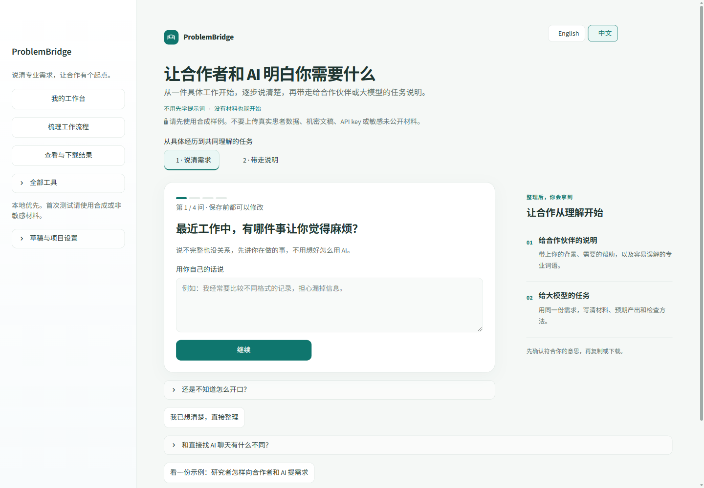

# ProblemBridge 工作台

[English](README.md) · [简体中文](README.zh-CN.md)

**把你的需求，说给其他专业的合作者和 AI 听。**

从一件具体工作开始，逐步说清困难、预期结果和专业词语，再带走两份说明：一份给合作伙伴，一份给大模型。

本地运行 · 中英双语 · 开始时无需 API key



## 三步开始使用

1. **说说你的工作。** 一次回答一个问题，暂时说不清的可以跳过。
2. **确认符合你的意思。** 修改表述、解释专业词语，写清怎样判断结果有用。
3. **带走两份说明。** 复制或下载，由你决定交给哪位合作者、放进哪个 AI。

有结果后，可按需使用 **ClaimHarness**，对照 CSV 表格核查可识别的英文数值表述。

## 本地运行

**Windows：** [下载源码 ZIP](https://github.com/RubyYii/ClaimHarness/archive/refs/heads/main.zip)，解压后双击 `RUN_PROBLEMBRIDGE_WINDOWS.bat`。

需要 Python 3.10–3.13。首次运行会安装依赖，并在浏览器打开本地页面 `http://127.0.0.1:8501`。

<details>
<summary>从终端安装与启动</summary>

在已激活的 Python 环境中，从仓库根目录运行：

```bash
python -m pip install -c requirements/constraints.txt -e ".[dev,ui]"
python -m streamlit run apps/problem_bridge_wizard.py
```

[环境设置与启动帮助](docs/reference.zh-CN.md#本地运行)

</details>

## 使用边界

目前使用本地预设问题引导，由你确认专业含义；说明不会自动发送给他人或大模型。证据核查有明确范围，不能证明事实正确，也不能代替专业人员判断。

请先用公开或合成材料。不要输入真实患者数据、机密文稿或敏感未公开材料；分享项目文件夹前，请清除本地记忆。

## 进一步了解

- **使用工作台：** [中文指南](docs/reference.zh-CN.md) · [English guide](docs/reference.md)
- **了解能力范围：** [功能与限制](docs/limitations.md)
- **配置可选工具：** [模型设置](MODEL_PROVIDER_GUIDE.md) · [OCR](OCR_SETUP.md)
- **开发与项目资料：** [架构](docs/architecture.md) · [文档索引](docs/project_map.md)

<details>
<summary>命令行证据核查示例</summary>

安装后，在仓库根目录通过 PowerShell 运行：

```powershell
.venv\Scripts\python.exe -m claim_harness run `
  --manuscript examples/lab_report_audit_demo/manuscript.md `
  --tables examples/lab_report_audit_demo/tables `
  --references examples/lab_report_audit_demo/references.md `
  --out outputs/lab_report_audit_demo_run `
  --llm mock
```

主要输出：`claim_table.csv`、`evidence_map.json`、`audit_report.md`、`revision_suggestions.md`、`agent_trace.jsonl`。

重复运行时，请为 `--out` 指定新的文件夹。[核查演示](docs/demo_walkthrough.md) · [使用与技术参考](docs/reference.zh-CN.md)

</details>
