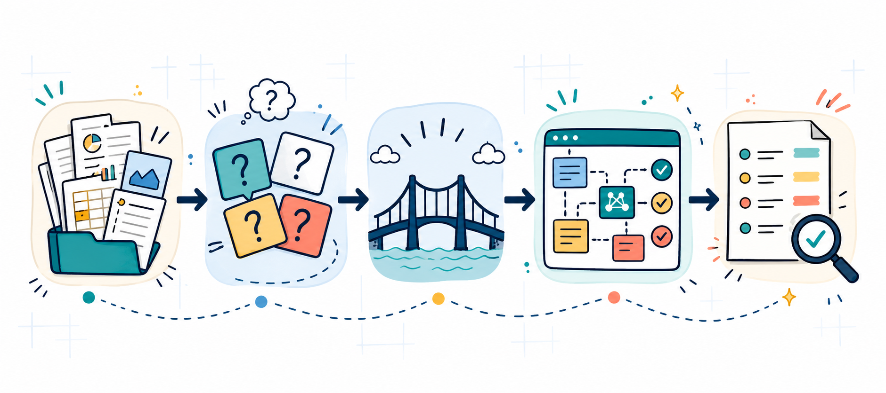
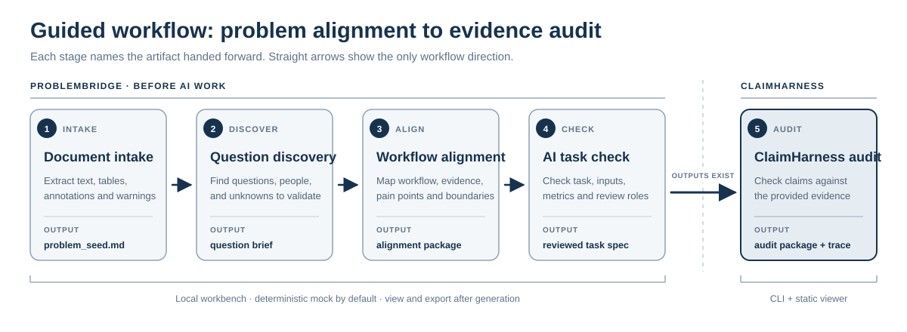

# ProblemBridge + ClaimHarness

<p align="center">
  
</p>

<p align="center">
  <strong>把模糊的工作感觉，变成具体问题、AI 任务边界和可审计证据。</strong><br>
  ProblemBridge 先帮你问清楚问题，ClaimHarness 再检查输出有没有证据支撑。也可以简单理解为：ProblemBridge 负责建模前的问题对齐，ClaimHarness 负责输出后的证据审计。
</p>

<p align="center">
  
  
  
  
</p>

<p align="center">
  <a href="#先看这里">先看这里</a> ·
  <a href="#本地运行">本地运行</a> ·
  <a href="#谁适合使用">谁适合使用</a> ·
  <a href="docs/static_showcase/zh-CN.html">中文静态展示</a> ·
  <a href="README.md">English</a>
</p>

**语言：**[English](README.md) | [简体中文](README.zh-CN.md)

**展示页：**[English static showcase](docs/static_showcase/en.html) | [中文静态展示](docs/static_showcase/zh-CN.html)

**开发复盘：**[开发经验整理](DEVELOPMENT_LESSONS.md)

## 先看这里

这个项目最适合这样的起点：

```text
我只是觉得某个工作流程很慢、很乱、有风险，或者很难说清楚。
我觉得 AI 可能能帮忙，但我还不知道应该问什么问题。
```

ProblemBridge 要做的第一件事，不是马上给方案，而是把这种模糊感觉变成可以和专业人士讨论的具体问题：

| 模糊感觉 | 它会帮助你追问成什么 |
| --- | --- |
| “这个审核环节太慢。” | 到底是哪一步慢？谁在判断？判断时看什么材料？ |
| “这里好像适合 AI。” | AI 应该辅助什么？哪些决定必须由人复核？什么输出才有用？ |
| “我不知道该问谁。” | 哪类专家、操作者、审核者或决策者掌握关键知识？ |
| “这个回答看起来挺合理。” | 哪些 claim 有证据支撑？哪些只是听起来流畅但证据弱或过度主张？ |

你不需要先懂模型、prompt、RAG 或 benchmark。先描述日常工作、判断材料、卡住的步骤、以及哪些决定不能交给 AI 自动完成。系统会帮助你生成问题清单、专家访谈方向、工作流说明、AI 任务规格、证据边界和审计结果。

## 项目一眼看懂

| 重点 | 说明 |
| --- | --- |
| **从模糊感觉开始** | 把“我觉得这里不太对”转成具体问题、该问的人、证据需求和复核边界。 |
| **默认不需要 API** | 首轮测试使用本地 deterministic mock mode，不调用外部模型。 |
| **引导式工作流** | 从文档摄取到问题发现、工作流对齐、AI 任务检查和结果查看，逐步继承上下文。 |
| **ProblemBridge** | 把领域工作流转成 AI 任务规格、证据契约、评价协议和人工复核边界。 |
| **ClaimHarness** | 检查文本或系统输出中的 claims 是否有证据支撑，并保留审计 trace。 |

<p align="center">
  
</p>

## 项目定位

ProblemBridge + ClaimHarness 是一个本地优先的跨学科 AI 原型。它不是普通写作工具，不是 STORM 复刻，也不是通用 RAG 报告生成器。它关注的是 AI 进入其他领域时最容易出错的两件事：

1. **建模前的问题对齐。**ProblemBridge 帮助团队从真实工作流、判断材料、痛点和人工复核边界出发，生成 AI 任务规格、证据契约、评价协议和风险报告。
2. **输出后的证据审计。**ClaimHarness 检查科研文本或 AI 生成内容中的 claims 是否被已有正文、表格或参考材料支持，并标记弱证据、过度主张和需要人工复核的地方。

默认演示使用 deterministic mock mode，不需要 API key，不调用外部模型，只使用合成样例。

## 文档摄取层

文档摄取层用于在问题发现或证据审计之前，把本地文件先转成可检查的文本和表格输出。这个步骤默认本地运行，不需要 API，也不会调用外部模型。

当前支持：

- `.docx` Word 文档，包括基础 Word 批注、高亮文本和字体颜色标记
- `.doc` 旧版 Word 文件会给出本地转换提示
- `.pdf` 文字版 PDF，并尽量提取 PDF 批注
- `.html` / `.htm` 保存下来的网页
- 本地 UI 中输入的公开静态 `http(s)` 网页 URL
- 图片文件（`.png`、`.jpg`、`.jpeg`、`.tif`、`.tiff`、`.bmp`），需要手动启用可选本地 OCR
- `.txt`
- `.md`
- `.csv`

输出包括：

- `extracted_text.md`
- `extracted_tables/`
- `annotation_map.json`
- `highlighted_spans.csv`
- `comment_threads.md`
- `priority_marks.md`
- `source_manifest.json`
- `ocr_quality_report.json`
- `extraction_warnings.md`
- `problem_seed.md`

在本地网页工作台里，文档摄取完成后会保留最近一次提取结果，并显示 `Continue to Question discovery` 按钮。点击后会把 `problem_seed.md` 自动带入问题发现表单，下一步不是空白开始，而是从已提取材料继续追问。

Word 批注、PDF 批注、高亮和字体颜色会被当作“用户注意力信号”保留下来，用于后续追问；系统不会自动推断某种颜色一定代表“高风险”或“已通过”。

边界很重要：OCR 是可选本地能力，不是默认依赖；URL 摄取只读取公开静态网页；不支持登录网页、JavaScript 执行、站点爬取、图片理解、figure 解释、手写标注意图识别或专业判断。它只负责提取文本、简单表格、链接和基础标注信号，不验证专业结论，也不能替代领域专家复核。OCR 同时受文件大小、页数、字符数、单次操作超时、PDF DPI 和单页像素上限约束。来自 OCR 的 claim 会标记为 `derived_text/ocr` 并进入人工原件核对；OCR 文本及 OCR 来源的“复核记录”本身都不能满足强证据或人工批准要求。

混合文字/扫描 PDF 按页 fail closed：如果部分页面能直接提取文字，而另一些页面没有文字层，系统会保留已提取的直接文本，在 `extraction_warnings.md` 中列出全部无文本页，但不会把这些页静默 OCR 后与直接文本合并，因为页级对应关系可能产生歧义。启用 OCR 时，`ocr_quality_report.json` 会记录 `mixed_pdf_requires_page_review` 及受影响页码。请人工查看原件；必要时把扫描页拆成单独的纯扫描 PDF 或图片再做 OCR。无文本页也可能本来就是空白页，因此警告不等于证明该页含扫描内容。

在 UI 中启用 OCR 后，可选择 `eng`、`chi_sim` 或 `eng+chi_sim`；对应 Tesseract 语言包必须已经安装。英文界面默认 `eng`，中文界面默认 `eng+chi_sim`，但系统不会自动检测文档语言。选择结果会写入 OCR 报告和运行规格。

OCR 图文安装说明见 [OCR_SETUP.md](OCR_SETUP.md)，也可以直接打开本地网页 [docs/ocr_setup.html](docs/ocr_setup.html)。
## 问题发现层

ProblemBridge 不假设用户一开始就知道真正的问题。问题发现层用于先提出问题、识别该问谁，并列出进入方案讨论前必须验证的未知项。

这个功能适合这样的状态：你只知道“这个工作流很慢”“这个环节好像适合 AI”“我想找专业领域的人问，但不知道该问谁、问什么”。它会在本地生成一个小型专家沟通包：

- `question_brief.md`
- `stakeholder_map.md`
- `expert_interview_guide.md`
- `unknowns_to_validate.md`
- `discussion_plan.md`

边界也很明确：先不要提出方案。先把值得问的问题、应该访问的人、需要验证的未知项梳理清楚，再进入引导式访谈或 ProblemBridge 对齐包生成。

在本地网页工作台里，问题发现完成后会显示 `Continue to Domain practitioner wizard` 按钮。它会把问题发现 seed 带入领域工作流表单的上下文里，让用户从“应该问什么”自然进入“应该重建哪段工作流”，不需要手动复制文件。

后续链路也会继续传递上下文：领域工作流向导生成对齐包后，可以点击 `Continue to AI practitioner wizard`，把 `ai_task_spec.yaml`、`evidence_contract.yaml`、`evaluation_protocol.md` 和人工复核边界带入 AI 任务检查；AI 对齐检查完成后，可以点击 `Continue to View generated outputs`，直接查看、导出或分享结果包。

## 引导式访谈引擎

ProblemBridge 的重点不是像普通聊天机器人一样马上回答，而是先通过引导式追问理解用户。系统会一次只问一个问题，维护当前的理解状态，显示已经理解的内容、还缺失的信息，以及当前完整度。

这也是它和常见大模型的差异：它会把用户从“我想要一个 AI”拉回到真实工作流，逐步还原判断材料、痛点、人工复核边界和可能的 AI 支持方式，然后再生成 AI 任务规格、证据契约和评价协议。

## 为什么需要它

很多跨学科 AI 项目并不是因为模型太弱而失败，而是在建模前就已经把领域问题压缩成了错误的 AI 任务：评价指标不对、证据边界不清、人工复核位置缺失，最后输出看起来流畅却不一定可靠。

这个项目的目标是给跨学科团队一个轻量 Harness：

```text
领域工作流
  ↓
ProblemBridge：问题对齐 / 工作流挖掘 / AI 任务规格化
  ↓
AI / researcher / team 进行建模、写作、系统设计
  ↓
ClaimHarness：claim-evidence 审计 / 风险路由 / trace logging
```

一句话概括：**ProblemBridge 负责开始之前不跑偏；ClaimHarness 负责输出之后不越界。**

## 谁适合使用

- **非 AI 背景的领域用户。**例如医生、教育者、文化研究者、政策研究者。你不需要先懂模型、prompt 或指标，只需要描述日常工作、判断材料、反复卡住的地方，以及哪些决定必须由人确认。
- **AI / 科研用户。**适合需要把领域问题转成任务规格、证据标准、评价协议和人工复核路线的人。
- **外部测试者。**适合先看合成样例，再用一个非敏感工作流测试本地网页 App。

## 功能概览

### ProblemBridge

ProblemBridge 用在 AI 工作开始之前，输出一个 Problem Alignment Package：

- 工作流图
- 痛点和机会矩阵
- 概念对齐表
- AI 任务规格
- 证据契约
- 评价协议
- 错位风险报告
- 人工复核计划
- 实施路线
- 对齐过程 trace
- `project_record.json`
- `project_summary_log.md`
- 首次记录修订后生成的 `revision_history.jsonl`
- 生命周期治理运行中的 `run_identity.json` 和 `run_complete.json`

### ClaimHarness

ClaimHarness 用在文本或系统输出之后，输出一个 evidence audit package：

- `claim_table.csv`
- `evidence_map.json`
- `audit_report.md`
- `revision_suggestions.md`
- `agent_trace.jsonl`
- `run_manifest.json`
- `project_summary_log.md`
- `run_identity.json`
- `run_complete.json`
- 提供 `--evidence-contract` 时生成的可选 `applied_evidence_contract.json`
- 可选静态报告 `index.html`

本地网页工作台还可以把任意生成结果目录导出为 `export_report.docx` 和 `export_report.pdf`。导出内容来自输出目录里已有的 Markdown、CSV、YAML、JSON 和 trace 文件，在本地生成，不需要 API key，也不会调用远程模型。

## 本地运行

如果你没有 AI 或编程基础，推荐直接运行本地网页 App：

```powershell
.\RUN_PROBLEMBRIDGE_WINDOWS.bat
```

本地网页 UI 支持中英双语界面。页面顶部可以选择 `English` 或 `中文`，语言会同步到 URL：`?lang=zh` 直接打开中文界面，`?lang=en` 直接打开英文界面。

如果你是从 GitHub clone：

```powershell
git clone https://github.com/RubyYii/ClaimHarness.git
cd ClaimHarness
.\scripts\run_problembridge_ui_powershell.ps1
```

浏览器打开后，建议顺序是：

1. 先看 `Explore examples`。
2. 生成一个合成样例。
3. 阅读 friendly summary。
4. 再进入 `Domain practitioner wizard`。
5. 描述一个非敏感、可重复的真实工作流。

CLI 用户可以运行：

```powershell
python -m venv .venv
.venv\Scripts\python.exe -m pip install -c requirements\constraints.txt -e ".[dev,ui]"
.venv\Scripts\python.exe -m problem_bridge demo
.venv\Scripts\python.exe -m claim_harness demo
```

## 可分享包

如果要分享给别人测试，可以发送本地压缩包：

```text
ProblemBridge-ClaimHarness-v0.4.0-local-webapp.zip
```

对方解压后双击：

```text
RUN_PROBLEMBRIDGE_WINDOWS.bat
```

第一次运行会创建 `.venv` 并安装依赖，然后在本地浏览器打开 UI。它不是在线服务，也不是 `.exe`。

维护者测试发布 ZIP 时，如果净克隆中没有仓库 `.venv`，并且 `PATH`
里的 `py` / `python` 也不可用，应显式传入现有 Python 3.10+ 解释器的绝对路径：

```powershell
.\scripts\test_release_zip_powershell.ps1 -PythonExe "<Python 解释器绝对路径>"
.\scripts\build_and_test_release_powershell.ps1 -PythonExe "<Python 解释器绝对路径>"
```

## 合成样例

当前仓库包含几个合成样例：

- Quality inspection review alignment：质检审核场景，强调视觉检测不等于最终通过/不通过判断。
- Cultural archive interpretation alignment：文化档案场景，强调识别物体不等于专家解释。
- Training policy response alignment：培训政策场景，强调流畅回答不等于有来源依据的政策对齐。
- ClaimHarness lab report audit demo：通用实验报告 claim-evidence 审计样例。

可以打开中文静态展示页查看：[`docs/static_showcase/zh-CN.html`](docs/static_showcase/zh-CN.html)。

## API 和模型

本地网页 UI 只运行确定性的 `mock` 工作流，不需要 API key，也不提供 provider、model、base URL 或 API-key 输入控件。远程模型提供商是可选的 advisory review，只能通过 ClaimHarness CLI 配置和运行。当前 CLI 支持 OpenAI-compatible、Qwen / DashScope、DeepSeek、Groq、Mistral、OpenRouter、xAI、Ollama、Gemini 和 Anthropic。

使用远程模型前要确认：你输入的内容会发送给外部服务。不要上传真实患者数据、机密论文、未公开项目材料、API key 或任何敏感信息。

本地网页 UI 不接收、收集或保存 API key。侧边栏的 `显示工作台记忆` 只保存草稿字段和最近输出目录，文件位于 `outputs/ui_memory/workbench_memory.json`。分享文件夹或 zip 前，如果草稿里有敏感工作流信息，请先清除本地记忆。

远程 provider 的公共 provenance 只保存 provider 名称、API style、模型、JSON mode 和 endpoint origin（协议、主机、端口），不保存 API key、URL 凭据、endpoint 路径或 query。完整 endpoint 配置只通过 `run_spec_sha256` 间接绑定，用于发现配置漂移，而不会把完整 URL 或凭据写进运行包。

Qwen / DashScope 可以使用 `qwen` provider：设置 `DASHSCOPE_API_KEY`，可选设置 `QWEN_BASE_URL` 和 `QWEN_MODEL`。

## 三轮修订治理

ProblemBridge 输出包现在包含 `project_record.json` 和 `project_summary_log.md`。可以用 `problem-bridge record-revision` 把每轮修改追加到 `revision_history.jsonl`。同一个稳定 target 最多修订三轮：第三轮仍未解决时必须升级为结构、规格或证据问题；在完成整合前，不允许继续打第四个局部补丁。

ClaimHarness 每次审计都会生成 `run_manifest.json` 和 `project_summary_log.md`。manifest 记录 run ID、工具版本、时间、provider 状态，以及输入/输出文件名、大小和 SHA-256，不暴露本地绝对路径；Markdown 摘要只是导航和 provenance 辅助，不是科学证据或批准记录。

v0.4 使用修订记录 schema v3：每条记录绑定不可变的 `project_id`，并包含 revision/parent ID、输入输出文件哈希、记录哈希链、跨进程文件锁和并发冲突检测。旧 v1/v2 记录不会在正常流程中直接读取或追加，必须运行 `problem-bridge migrate-revision-history`，并明确输入完全一致的项目 ID 后才能迁移。三轮上限没有放宽；第三轮必须接受或升级，不能继续写第四轮。

`problem-bridge record-revision` CLI 现在必须选择且只能选择一种证据路线：至少提供一个可重复的 `--output-artifact`（相对于 `--project` 目录解析），或者在确实没有可哈希结果时提供 `--no-artifact-hash-reason "..."`。两者不能同时使用。`--changed-file` 只是描述字段，不能代替输出哈希；缺失原因只记录证据缺口，并不提供文件完整性。

## v0.4 项目与证据治理

- 每个项目有稳定 `project_id`，每次运行有唯一 `run_id`；`run_identity.json` 绑定工作流类型与运行规格 SHA-256。CLI 的运行规格包含工具版本、输入和 provider 配置，因此不同工作流、规格或工具版本不能伪装成同一次 `resume`。
- ProblemBridge 与 ClaimHarness CLI 都使用明确的 `new`、`resume`、`replace` 模式。`resume` 或 `replace` 必须同时由用户提供 `--project-id` 和 `--expected-run-id`；不能只信任可编辑的身份文件。
- `run_complete.json` 最后写入，并记录治理范围内的精确文件快照。Document intake 会逐个哈希 allow-list 内 `extracted_tables/` 和 `source_files/` 的嵌套非符号链接文件，因此提取表格与原件字节都受完整性检查；未知根目录文件不冒充系统产物。
- 分享 ZIP 只从生成物 allow-list 取文件，默认排除 `source_files/` 和未知/可能私密文件，并生成带精确路径、大小和 SHA-256 的 `share_manifest.json`。只有显式勾选后才会包含原件。项目级删除必须输入当前项目 ID，随后删除该项目的全部运行及原件。
- Document intake 生成 `ocr_quality_report.json`，记录 OCR 引擎、版本、语言、逐页定位、超时、DPI、像素和其他资源上限及失败信息。`derived_text/ocr` 默认不能作为强证据；从 OCR 输入提取的 claim 必须人工检查原件，也不代表系统理解图表或图片含义。
- Windows 首次安装与日常启动已分开。正常启动不会每次重新安装依赖；发布门会在 Windows 上构建、测试并生成 ZIP manifest 和 SHA-256。

ProblemBridge 生成的证据契约可以直接交给 ClaimHarness。严格的 schema v2 契约同时绑定稳定 `project_id` 和由契约内容计算得到的 `contract_id`；ClaimHarness 会拒绝项目 ID 不一致或内容 ID 不匹配的契约，并在运行 provenance 中记录这两个 ID 与契约哈希：

```powershell
.venv\Scripts\python.exe -m claim_harness run `
  --manuscript examples/lab_report_audit_demo/manuscript.md `
  --tables examples/lab_report_audit_demo/tables `
  --references examples/lab_report_audit_demo/references.md `
  --evidence-contract outputs/problem_bridge_quality_inspection_demo/evidence_contract.yaml `
  --out outputs/lab_report_contract_audit `
  --llm mock
```

未知 schema、规则、来源类型、证据类型、人工复核角色、项目绑定或内容 ID 会在写输出前失败。提供契约时，审计包还会生成 `applied_evidence_contract.json`：它是经过验证、实际执行的契约的规范化 JSON 快照，并随运行一起受治理和哈希；未提供契约时该文件不存在。未提供契约时仍保留原有验证行为。

离线合成评测：

```powershell
.venv\Scripts\python.exe scripts\evaluate_gold_set.py --out outputs\synthetic_evaluation
```

该命令报告 claim precision/recall/F1、evidence recall@k、status macro-F1/confusion、高风险漏检率、**不安全高风险决策率**和 abstention rate。这只是小型版本化合成回归门，不是完整 gold 评测，也不是现实有效性、临床安全性、跨领域或跨语言能力证明。完整升级说明见 [`docs/v0.4_upgrade.md`](docs/v0.4_upgrade.md)。

## 安全边界

- 这是原型，不是临床、法律或教育政策决策系统。
- 不保证事实正确性。
- 只检查你提供的材料。
- biomedical 或高风险 claims 仍然需要人工复核。
- Results 章节中的自述不会自动成为该 claim 的强证据；强表格证据必须有可核验的指标/数值关系。
- mock mode 是确定性的演示模式，不等于完整语义理解。
- 中文界面不等于中文 claim 审计已验证；当前规则和合成 gold set 以英文为主，中文稿件必须人工复核。
- 不要输入真实患者数据、机密论文、未公开项目材料、API key 或任何敏感内容。

## 路线图

- v0.1：ClaimHarness 科研 claim-evidence audit demo。
- v0.2：ProblemBridge 问题对齐 MVP。
- v0.3：稳定、可审计基线（已完成），包括确定性证据检索/验证、文档摄取、摘要日志、三轮治理和发布 smoke test。
- v0.4：证据契约与项目生命周期（当前），包括 schema-v2 契约、运行身份、完成快照、安全分享、OCR 质量门和合成评测门。
- v0.5：在一个获批准且不含私密材料的仓库内进行有边界试点。
- v0.6：开展 human review study，并在版本化中文 gold set 通过明确门槛后再增加中文 claim 审计支持。
- v0.7：在一个真实跨学科项目中开展 FDE pilot，记录任务定义、证据契约、评测协议与复核负担的前后变化。
