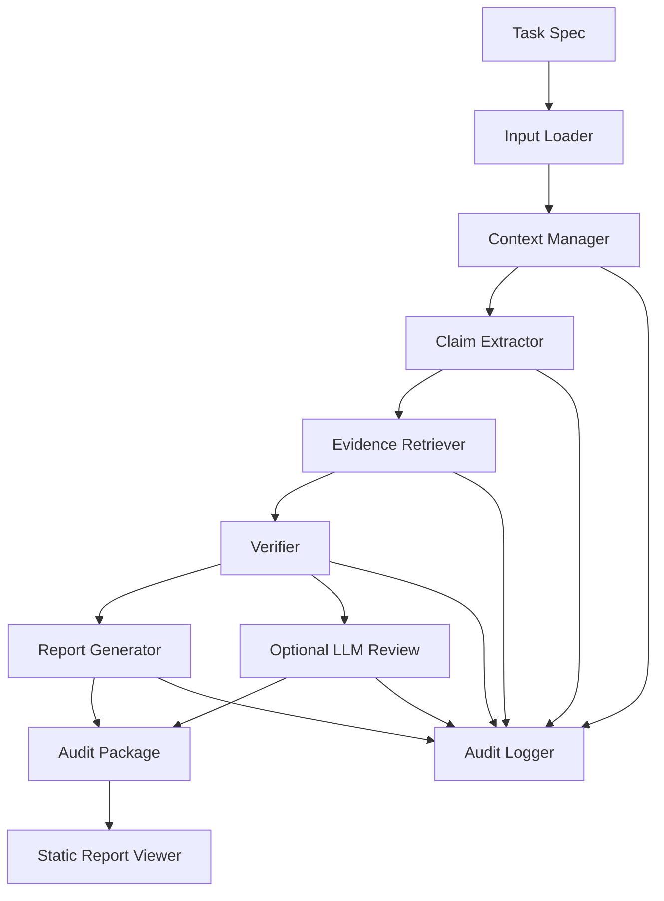

# ClaimHarness Architecture

ClaimHarness is a CLI-first Agent Harness for scientific claim-evidence auditing. It keeps the first implementation small, deterministic, and auditable.

## Pipeline

## Modules

`claim_harness.cli` orchestrates the `run`, `view`, and `demo` commands. It validates `--llm mock` or `--llm openai-compatible`, loads inputs, calls the pipeline modules, writes outputs, and prints a concise summary.

`claim_harness.loader` reads Markdown manuscript sections, CSV tables, and references.

`claim_harness.context_manager` packages loaded inputs into an `AuditContext`.

`claim_harness.claim_extractor` uses deterministic keyword rules to extract claim-like sentences, assign `C001`, `C002`, and later IDs, and preserve an approximate `source_line` for manuscript traceability.

`claim_harness.evidence_retriever` converts table rows, Results text, Discussion limitations, and references into evidence items. Each claim-evidence link records a match reason such as lexical overlap or source-token matching.

`claim_harness.verifier` assigns support labels: `supported`, `weakly_supported`, `unsupported`, `overclaimed`, or `needs_human_review`.

`claim_harness.report_generator` writes the audit package.

`claim_harness.llm` isolates provider configuration, prompt loading, structured JSON request construction, and optional OpenAI-compatible review calls. The optional provider runs after deterministic verification and does not change claim statuses.

`claim_harness.report_viewer` renders an existing audit package as a static `index.html` file. It is a read-only presentation layer and does not run a server or change audit results.

`claim_harness.audit_logger` records replayable JSONL trace events in `agent_trace.jsonl`.

## Data Objects

The shared schemas are:

- `ManuscriptSection`
- `Claim`
- `EvidenceItem`
- `VerificationResult`
- `AuditEvent`

These objects make intermediate state explicit. That explicit state is the main difference between this harness and a prompt-only review.

`Claim.source_line` helps reviewers navigate back to the manuscript. `EvidenceItem.claim_link_reasons` records why an evidence item was attached to each linked claim.

## Output Package

The output package contains:

- `claim_table.csv`: claim-level status table.
- `evidence_map.json`: evidence-to-claim links.
- `audit_report.md`: human-readable audit summary.
- `revision_suggestions.md`: rewrite suggestions for risky or weak claims.
- `agent_trace.jsonl`: replayable step trace.
- `llm_review.json`: optional advisory review when `--llm openai-compatible` is selected.
- `index.html`: optional static report viewer generated by `claim_harness view`.
