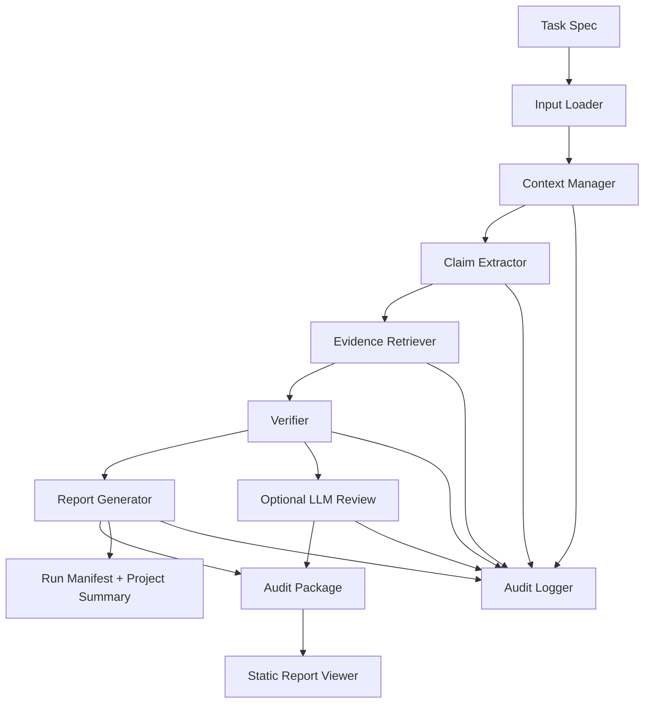

# ClaimHarness Architecture

ClaimHarness is a CLI-first Agent Harness for scientific claim-evidence auditing. It keeps the first implementation small, deterministic, and auditable.

## Pipeline

```mermaid
flowchart TD
    A["Task Spec"] --> B["Input Loader"]
    B --> C["Context Manager"]
    C --> D["Claim Extractor"]
    D --> E["Evidence Retriever"]
    E --> F["Verifier"]
    F --> G["Report Generator"]
    G --> H["Audit Package"]
    G --> L["Run Manifest + Project Summary"]
    F --> J["Optional LLM Review"]
    J --> H
    H --> K["Static Report Viewer"]
    C --> I["Audit Logger"]
    D --> I
    E --> I
    F --> I
    G --> I
    J --> I
```

## Modules

`claim_harness.cli` orchestrates the `run`, `view`, and `demo` commands. It validates `--llm mock` or one of the optional remote provider presets, loads inputs, calls the pipeline modules, writes outputs, and prints a concise summary.

`claim_harness.loader` reads Markdown manuscript sections, CSV tables, and references.

`claim_harness.context_manager` packages loaded inputs into an `AuditContext`.

`claim_harness.claim_extractor` uses deterministic keyword rules with word-boundary, negation, and attribution checks to extract claim-like sentences, assign `C001`, `C002`, and later IDs, and preserve the source line for manuscript traceability.

`claim_harness.evidence_retriever` converts table rows, Results text, Discussion limitations, and references into located evidence items. Results prose is candidate context and cannot automatically act as strong evidence for the same claim. Table evidence is strong only when the deterministic rules can verify a metric/value relationship; links distinguish support, contradiction, and topical relation.

`claim_harness.verifier` assigns support labels: `supported`, `weakly_supported`, `unsupported`, `overclaimed`, or `needs_human_review`.

`claim_harness.report_generator` writes the audit package.

`claim_harness.llm` isolates provider configuration, prompt loading, structured JSON request construction, and optional advisory review calls. It includes OpenAI-compatible presets plus native Gemini and Anthropic request builders. Remote providers are ClaimHarness CLI-only, run after deterministic verification, and do not change claim statuses. The local Streamlit UI is deterministic mock-only and never accepts or stores API keys.

`claim_harness.report_viewer` renders an existing audit package as a static `index.html` file. It is a read-only presentation layer and does not run a server or change audit results.

`claim_harness.audit_logger` records ordered JSONL trace events in `agent_trace.jsonl`. The trace supports inspection but is not a complete execution replay by itself.

`claim_harness.run_records` writes `run_manifest.json` and `project_summary_log.md`. The manifest records run identity, version, timestamps, provider status, and filename/size/SHA-256 records without exposing absolute paths. The Markdown summary is a navigation aid, not scientific evidence or approval.

## Data Objects

The shared schemas are:

- `ManuscriptSection`
- `Claim`
- `EvidenceItem`
- `VerificationResult`
- `AuditEvent`

These objects make intermediate state explicit. That explicit state is the main difference between this harness and a prompt-only review.

`Claim.source_line` helps reviewers navigate back to the manuscript. `EvidenceItem.claim_link_reasons` records why an evidence item was attached to each linked claim.

## Output Package

The output package contains:

- `claim_table.csv`: claim-level status table.
- `evidence_map.json`: evidence-to-claim links.
- `audit_report.md`: human-readable audit summary.
- `revision_suggestions.md`: rewrite suggestions for risky or weak claims.
- `agent_trace.jsonl`: ordered, inspectable step trace.
- `run_manifest.json`: machine-readable run provenance and input/output hashes.
- `project_summary_log.md`: human-readable run summary and revision guardrail.
- `llm_review.json`: optional advisory review when a remote `--llm` provider is selected.
- `index.html`: optional static report viewer generated by `claim_harness view`.

## Bounded Revision Governance

ProblemBridge packages include `project_record.json` and `project_summary_log.md`. The `problem-bridge record-revision` command appends `revision_history.jsonl` after the first revision. Each stable target is limited to three rounds; round three must be accepted or escalated, and a fourth local patch is rejected until the specification, evidence, or structure is consolidated.

The ProblemBridge and ClaimHarness files named `project_summary_log.md` have different schemas: ProblemBridge summarizes project boundaries and revision history, while ClaimHarness summarizes one audit run. Interpret each file within its own output directory.
