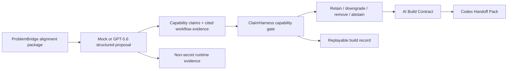
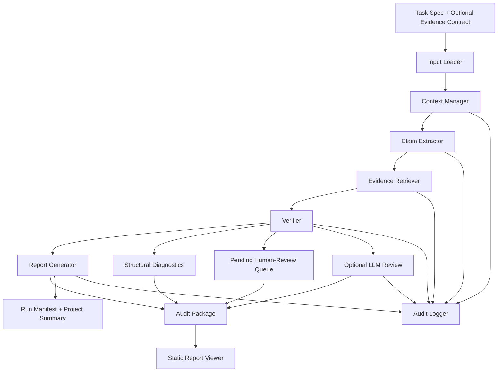

# ClaimHarness Architecture

ClaimHarness is a CLI-first Agent Harness for scientific claim-evidence auditing. It keeps the first implementation small, deterministic, and auditable.

## Build Week evidence-gated build pipeline

```mermaid
flowchart LR
    A["ProblemBridge alignment package"] --> B["Mock or GPT-5.6 structured proposal"]
    B --> C["Capability claims + cited workflow evidence"]
    C --> D["ClaimHarness capability gate"]
    D --> E["Retain / downgrade / remove / abstain"]
    E --> F["AI Build Contract"]
    F --> G["Codex Handoff Pack"]
    D --> H["Replayable build record"]
    B --> I["Non-secret runtime evidence"]
```

`problem_bridge.build_contract` owns the Build Week orchestration and export
surface. It accepts a previously constructed `AlignmentPackage`, uses a
deterministic proposal in mock mode or GPT-5.6 strict Structured Outputs in
OpenAI mode, invokes `claim_harness.capability_gate`, and writes the final
contract, decision table, runtime record, trace, and handoff directory.

`claim_harness.capability_gate` is deliberately deterministic. It validates
evidence references against an allow-list, detects autonomous authority and
guarantee language, routes high-stakes claims to human review, and preserves the
same five evidence statuses used by manuscript auditing. In this path,
`supported` means supported as a bounded workflow-design requirement; it does
not mean empirically validated performance.

## Pipeline

```mermaid
flowchart TD
    A["Task Spec + Optional Evidence Contract"] --> B["Input Loader"]
    B --> C["Context Manager"]
    C --> D["Claim Extractor"]
    D --> E["Evidence Retriever"]
    E --> F["Verifier"]
    F --> G["Report Generator"]
    F --> M["Structural Diagnostics"]
    F --> N["Pending Human-Review Queue"]
    G --> H["Audit Package"]
    M --> H
    N --> H
    G --> L["Run Manifest + Project Summary"]
    F --> J["Optional LLM Review"]
    J --> H
    H --> K["Static Report Viewer"]
    C --> I["Audit Logger"]
    D --> I
    E --> I
    F --> I
    G --> I
    J --> I
```

## Modules

`claim_harness.cli` orchestrates the `run`, `view`, `demo`, and `providers` commands. It validates `--llm mock`, an allow-listed installed-client adapter, or an optional direct provider preset; loads inputs; calls the pipeline modules; writes outputs; and prints a concise summary. `providers` is a passive inventory by default. A real synthetic request is possible only when one provider is named with `--probe` and the separate `--confirm-call` consent flag is present.

`claim_harness.loader` reads Markdown manuscript sections, CSV tables, and references.

`claim_harness.evidence_contract` validates a strict schema-v2 contract before output mutation. It defines allowed source kinds, strong evidence types, minimum counts, forbidden-without rules, and human-review roles. Each contract binds a stable `project_id` to a content-derived `contract_id`; the ClaimHarness CLI also checks that the requested project matches the contract. Unknown policy fields, identity mismatches, and content-ID mismatches fail closed.

`claim_harness.context_manager` packages loaded inputs into an `AuditContext`.

`claim_harness.claim_extractor` uses deterministic keyword rules with word-boundary, negation, and attribution checks to extract claim-like sentences, assign `C001`, `C002`, and later IDs, and preserve the source line for manuscript traceability.

`claim_harness.evidence_retriever` converts table rows, Results text, Discussion limitations, and references into located evidence items. Results prose is candidate context and cannot automatically act as strong evidence for the same claim. Table evidence is strong only when the deterministic rules can verify a metric/value relationship; links distinguish support, contradiction, and topical relation. A base table evidence item preserves the full row while `claim_link_locators` narrows each claim link to the cells that matched that claim. Locators expose only safe basenames, never absolute paths; page numbers are not inferred when the upstream input does not provide them.

`claim_harness.verifier` assigns support labels: `supported`, `weakly_supported`, `unsupported`, `overclaimed`, or `needs_human_review`. Evidence from `ocr` or `derived_text` is excluded from strong-evidence and human-approval checks; a claim extracted from derived input is always routed to `needs_human_review` with `source_inspection` outstanding.

`claim_harness.report_generator` writes the audit package.

`claim_harness.diagnostics` derives deterministic, gold-label-free structural diagnostics. It separates any relation from deterministic support relations and reports every ratio with its numerator and denominator. A support relation can still belong to a `weakly_supported` claim whose requirements remain unmet. The module does not calculate accuracy, faithfulness, hallucination, or scientific validity.

`claim_harness.review_queue` creates an immutable snapshot of pending review work. Queue entries route claims and required roles but contain no decision field, cannot satisfy a verifier requirement, and do not establish reviewer identity, qualifications, or approval.

`claim_harness.llm` isolates provider configuration, prompt loading, structured JSON request construction, bounded timeout selection, and optional advisory review calls. The official `openai` preset uses the Responses API and defaults to `gpt-5.6`; the separate `openai-compatible` preset retains Chat Completions compatibility. Qwen, Kimi, and DeepSeek have named direct-API presets; Kimi defaults to the OpenAI-compatible Moonshot endpoint, `kimi-k3`, and JSON mode while omitting an explicit temperature so the provider can enforce the selected model's fixed/default sampling contract. Native Gemini and Anthropic request builders remain available for ClaimHarness advisory summaries. Installed-client presets route through `local-agent-cli` and still pass their returned object through the same strict `LLMAuditReview` validation. The Evidence-Gated Build page may invoke the official OpenAI path, but it reads the key only from the launch environment and never accepts or stores credentials. Persisted public provider provenance is restricted to non-secret provider/model/API metadata, the 1-600 second timeout, and hashes.

`claim_harness.provider_status` produces sanitized offline availability rows. It checks only environment-variable presence, normal configuration syntax, and executable discovery via static path lookup. It does not call an endpoint, run a discovered command, read an app's credential store, or expose credential values, configured URLs, and executable paths. Its separate probe helper sends only fixed synthetic prompts, accepts one provider and a bounded timeout, and returns generic diagnostics; the CLI will not call it without explicit confirmation. Supported options and detection-only candidate clients are deliberately separate states.

`claim_harness.local_agent_cli` is a narrow process boundary for the allow-listed `codex`, `claude-cli`, and `qwen-cli` providers. It resolves only the expected executable (or one executable-only environment override), validates executable files and bounded model identifiers before launch, sends audit data over stdin, runs in a temporary working directory, and applies each client's documented non-interactive structured-output and tool-restriction flags. Concurrent readers retain only fixed-size stdout/stderr buffers and terminate the process tree immediately on overflow; timeouts receive the same process-tree cleanup. The adapter strips terminal control sequences and rejects non-object JSON. It does not automate desktop GUI windows or accept arbitrary shell templates. Authentication remains owned by the selected client, so this layer cannot attest whether a subscription, API key, Coding Plan, custom provider, or local backend was used.

Kimi Code, Deep Code, and DeepSeek TUI remain outside that execution allow-list. The inventory may detect their command names, but they are not selectable until a reviewed contract provides bounded stdin input, reliable strict structured output, and non-experimental tool isolation. Deep Code and DeepSeek TUI are third-party clients; detection does not imply endorsement.

`claim_harness.report_viewer` renders an existing audit package as a static `index.html` file. It is a read-only presentation layer and does not run a server or change audit results.

`claim_harness.audit_logger` records ordered JSONL trace events in `agent_trace.jsonl`. The trace supports inspection but is not a complete execution replay by itself.

`claim_harness.run_records` writes `run_manifest.json` and `project_summary_log.md`. The manifest records run identity, version, timestamps, sanitized public provider provenance, and filename/size/SHA-256 records without exposing absolute paths or credentials. The Markdown summary is a navigation aid, not scientific evidence or approval.

`claim_harness.evaluation` runs the deterministic pipeline on a small, versioned synthetic JSONL set and reports extraction, retrieval, status, high-risk miss, unsafe high-risk decision, and abstention metrics without network access. This is a regression gate, not a complete gold evaluation.

`problem_bridge.document_intake` extracts direct text first and runs optional bounded OCR for image-only inputs. Mixed text/scanned PDFs fail closed at the page boundary: direct text is retained, every no-text page is warned, and page-selective OCR is not silently merged because a no-text page may be an intentional blank or an ambiguously aligned scan. With OCR enabled, the report records `mixed_pdf_requires_page_review`. The UI exposes explicit `eng`, `chi_sim`, and `eng+chi_sim` choices; it supplies a language-dependent default but performs no automatic language detection.

`problem_bridge.project_lifecycle` provides identity-bound `new`, `resume`, and `replace` modes, allow-listed cleanup, cross-process locking, staged flat-file writes, artifact hashes, and a completion marker published last. `run_identity.json` records the workflow type and canonical run-specification hash; the ClaimHarness and ProblemBridge CLI specifications include the tool version, so `resume` rejects workflow, input/configuration, or version drift. Both `resume` and `replace` require the caller to provide `project_id` and `expected_run_id` independently of the editable identity file.

`run_complete.json` binds the identity-file hash to the exact governed artifact set. Document-intake runs additionally register `extracted_tables/` and `source_files/` as allow-listed snapshot directories; Evidence-Gated Build registers `codex_handoff/`. Every nested non-symlink file is hashed, and later additions, removals, or byte changes invalidate completion. `replace` preflights and clears both the old and requested run-owned snapshot trees so stale nested files cannot enter the next run. Unknown root files are outside the governed set. The local UI allocates unique runs, hides incomplete or deletion-pending governed runs, builds share ZIPs from verified generated-artifact snapshots, rejects linked/junction run roots, excludes originals and unknown files by default, and offers project-level deletion only after exact project-ID confirmation. Deletion binds the marker to the live identity and atomically renames the authorized run before recursive cleanup, so a newly created run at the old path is not removed by delayed cleanup.

## Data Objects

The shared schemas are:

- `ManuscriptSection`
- `Claim`
- `EvidenceItem`
- `EvidenceCell`
- `EvidenceLocator`
- `VerificationResult`
- `AuditEvent`

These objects make intermediate state explicit. That explicit state is the main difference between this harness and a prompt-only review.

`Claim.source_line` helps reviewers navigate back to the manuscript. `EvidenceItem.claim_link_reasons` records why an evidence item was attached to each linked claim, while `EvidenceItem.claim_link_locators` records the claim-specific file/line or table row/cells used for that link.

## Output Package

The output package contains:

- `claim_table.csv`: claim-level status table.
- `evidence_map.json`: evidence-to-claim links.
- `audit_report.md`: human-readable audit summary.
- `revision_suggestions.md`: rewrite suggestions for risky or weak claims.
- `audit_diagnostics.json`: single-run structural coverage, gap, contradiction, risk-routing, and unused-evidence diagnostics with explicit boundaries.
- `human_review_queue.json`: pending claim-role work items; never a decision or approval artifact.
- `agent_trace.jsonl`: ordered, inspectable step trace.
- `run_manifest.json`: machine-readable run provenance and input/output hashes.
- `project_summary_log.md`: human-readable run summary and revision guardrail.
- `run_identity.json`: stable project/run identity, lifecycle mode, workflow type, run-specification hash, owned/required artifacts, and allow-listed snapshot directories.
- `run_complete.json`: identity hash plus the exact governed artifact hashes, including nested table/original files for document-intake runs; published last.
- `applied_evidence_contract.json`: optional normalized snapshot of the exact validated contract executed for this audit; present and governed only when `--evidence-contract` is supplied.
- `llm_review.json`: optional advisory review when any non-mock `--llm` provider or installed-client adapter is selected.
- `index.html`: optional static report viewer generated by `claim_harness view`.

## Bounded Revision Governance

ProblemBridge packages include `project_record.json` and `project_summary_log.md`. The `problem-bridge record-revision` command appends `revision_history.jsonl` after the first revision. Its CLI requires at least one repeatable `--output-artifact` or an explicit `--no-artifact-hash-reason`; the options are mutually exclusive, and a descriptive `--changed-file` is not a hash substitute. Each stable target is limited to three rounds; round three must be accepted or escalated, and a fourth local patch is rejected. Schema v3 binds every record to the immutable `project_id` and records revision/parent IDs, input/output hashes, and a tamper-evident record chain under a cross-process lock. Legacy v1/v2 histories are rejected by normal reads and appends; one homogeneous history can be rebound only through the explicit migration command with exact project-ID confirmation.

The ProblemBridge and ClaimHarness files named `project_summary_log.md` have different schemas: ProblemBridge summarizes project boundaries and revision history, while ClaimHarness summarizes one audit run. Interpret each file within its own output directory.
