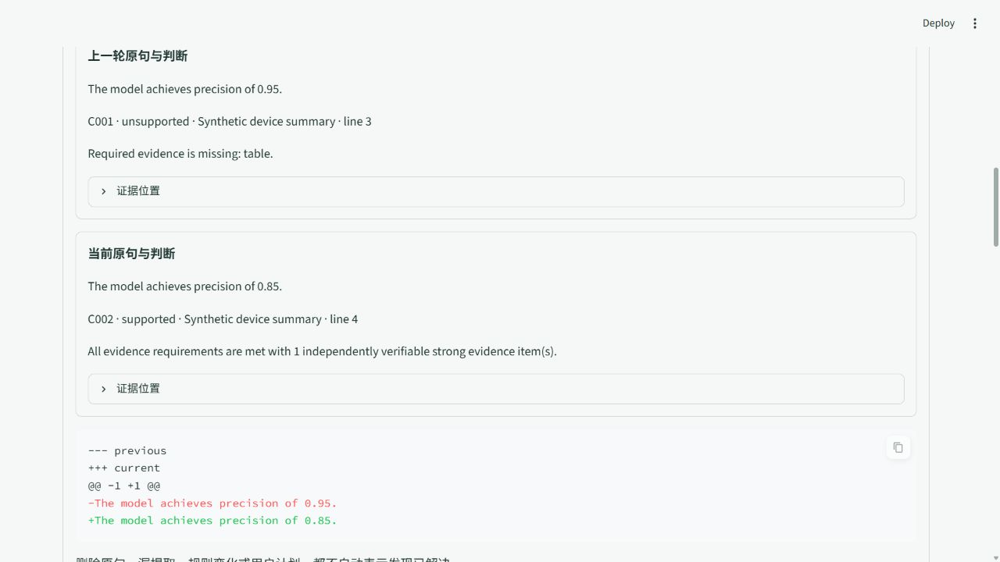
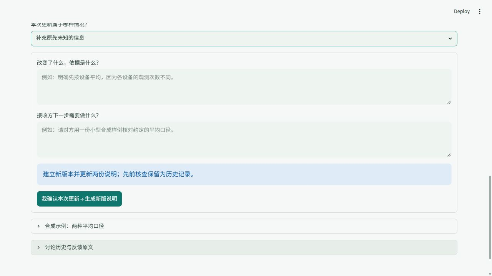

# 连续反馈与复查：合成界面证据

本目录保存两张真实浏览器截图和一份验收摘要，便于在其他机器上阅读本轮交付。输入均为合成示例；没有真实患者材料、真人评估或科学有效性验证。





ClaimHarness 截图来自独立比较应用。ProblemBridge 截图来自调用真实反馈组件的合成预览，完整工作台流程另由 AppTest 验证。截图是桌面视口，不是整个长页面或全设备测试。

`verification_summary.json` 保留最终 18 项功能测试、2 项发布包复测、上传前独立暂存副本的 55 项回归、完整回归的原始计数、仍未通过的既有检查、原日志哈希和本目录截图哈希。原日志留在本地，没有把不同测试运行的结果合并成一次“全部通过”。

从仓库根目录重跑功能测试：

```bash
python -m pytest -q tests/test_audit_continuity.py tests/test_feedback_continuity.py tests/test_continuity_ui.py --basetemp=.pytest_tmp_continuity
python scripts/run_continuity_demo.py --out outputs/continuity_demo_new
```

Windows 若拒绝仓库内测试目录的重命名，可将 `--basetemp` 改为新的系统临时目录；发布 ZIP 隔离测试的临时虚拟环境须位于源码仓库外。更多依据和限制见 [验收记录](../continuity_verification_2026-10-08.md)。
