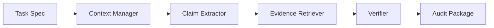

# User and technical reference

[Home](../README.md) · [中文参考](reference.zh-CN.md) · [Documentation index](project_map.md)

[Static demo](static_showcase/en.html)

The first section describes the current needs-to-handoffs journey. Later sections cover optional tools, command-line use and maintenance. Commands run from the repository root, not this documentation folder.

[Current implementation and 14-issue status](external_review_reconciliation.md) · [OCR setup](../OCR_SETUP.md) · [Offline OCR guide](ocr_setup.html)

## First run

Double-click `RUN_PROBLEMBRIDGE_WINDOWS.bat`. **My workbench** starts with a real task and helps prepare a need that a collaborator from another discipline or a language model can take forward: **Describe your work → Take your briefs**. ClaimHarness checks are optional once results exist. No prompt-writing experience, files or API configuration are needed to start.

The novice route asks one short question at a time: your work, a concrete difficulty, the result you want and available materials. Skip unknowns, go back, and edit before confirming. Existing interview answers can seed the review. Optional context includes your background, the collaborator's contribution, ambiguous terms with examples/counterexamples, a small-sample acceptance check and human boundaries. User wording is retained and gaps stay open; specialist meanings are not invented.

The responsive layout keeps the current question in a focused card, with an explanation of the two handoffs alongside it on desktop and below it on mobile. The review form groups context and expected results; both exports have readable document previews. A bundled light theme keeps native controls and primary actions consistent. See the [layout verification record](layout_polish_2026-09-22.md).

Choose **This reflects my need → prepare both handoffs** to preview, copy or download a collaborator brief and a language-model task. Both use the same confirmed record. Nothing is sent automatically; listed materials must be attached separately. The synthetic art-research example shows the result without file uploads. New records save both interface languages (`collaboration_brief_en.md` / `collaboration_brief_zh.md`, `model_task_en.md` / `model_task_zh.md`); supplied wording is not automatically translated.

Problem saves, audits and follow-ups create immutable revisions and save a current-project resume pointer. Reopening resumes the same problem. Editing needs clears their current audit link and retains old results in history. To retain unfinished questions or concept notes, use **Drafts & project settings → Show workspace memory → Save current workspace**. Clear local memory before sharing sensitive drafts. **All tools** and the collapsed optional helpers retain the original workflows.

**When results exist:** paste text or upload Markdown/TXT and CSV tables to run the local audit. Findings retain claim IDs and source locations; a saved follow-up does not change a verdict. Checks remain bounded and primarily cover English numerical claims. Extraction coverage is unknown, including when no statements are found. Handoffs are not empirical evidence or recipient agreement. The local questions are predefined guidance, not unrestricted semantic interpretation or task execution. Custom evidence contracts and remote advisory audit providers remain CLI options. See [the cross-disciplinary handoff design](cross_disciplinary_handoff.md) and [the audit workflow design](unified_workbench_design.md).

The workbench executes the deterministic ClaimHarness audit through the same pipeline as the CLI.

## Run Locally

For non-AI users, start with the local guided app:

```powershell
.\RUN_PROBLEMBRIDGE_WINDOWS.bat
```

The Streamlit workbench includes a bilingual English/Chinese interface switch at the top of the page. The selected language is reflected in the URL, so `?lang=zh` opens the Chinese interface and `?lang=en` opens the English interface. Switching languages stays in the same browser tab and preserves the active local project. Current Streamlit releases still emit the outer document as `lang="en"` in Chinese mode, so screen-reader pronunciation may not switch automatically even though the language control itself exposes the correct accessible name and checked state.

The guided interaction now keeps the full overview on Home and uses a compact workflow header on task pages. Required forms show inline guidance without creating an empty run. Question discovery seeds the one-question-at-a-time interview, the completed interview remains editable before generation, and the AI handoff separates the domain problem, candidate task, inputs, outputs, evaluation, and high-risk boundaries instead of copying raw YAML into several fields. The reviewer field stays blank until the user confirms a real role. Generated results keep the next action above the expanded review and collapsed technical files.

`View generated outputs` is scoped to the active project by default. Turn on the explicit all-projects option only when you need to compare workspaces; each history label includes the verified UTC time, workflow, project identifier, and legacy status when applicable.

When an older ClaimHarness package does not contain the newer diagnostics files, the audit-specific view reports them as unavailable instead of presenting missing values as zero.

The workbench runs local evidence checks and also opens existing ClaimHarness packages with the audit-specific view. CLI runs remain available and can be opened in `View generated outputs` or the static `index.html` viewer.

If you are cloning from GitHub manually:

```powershell
git clone https://github.com/RubyYii/ClaimHarness.git
cd ClaimHarness
.\scripts\run_problembridge_ui_powershell.ps1
```

For CLI users:

```powershell
python -m venv .venv
.venv\Scripts\python.exe -m pip install -c requirements\constraints.txt -e ".[dev,ui]"
.venv\Scripts\python.exe -m problem_bridge demo
.venv\Scripts\python.exe -m claim_harness demo
```

These commands create new runs. For another run, pass a fresh `--out` directory;
an existing completed or legacy directory is intentionally not overwritten.
See [safe output lifecycle](v0.4_upgrade.md#safe-output-lifecycle) for
identity-checked `resume` and `replace` operations.

## Guided UI for non-AI users

ProblemBridge also includes an optional local guided UI for people who do not already know how to describe an AI task. It starts from repeated work, workflow steps, judgement materials, pain points, human-review boundaries, and useful assistant outputs. The UI then generates the same Problem Alignment Package used by the CLI.

Install the optional UI dependencies:

```powershell
.venv\Scripts\python.exe -m pip install -c requirements\constraints.txt -e ".[dev,ui]"
```

The constrained setup pins Streamlit 1.58.0. This version supplies the required-selection control and AppTest behavior used by the guided interview, so older environments should be upgraded with the command above before launching the UI.

Run the local Streamlit wizard:

```powershell
.venv\Scripts\python.exe -m streamlit run apps/problem_bridge_wizard.py
```

The wizard includes:

- Explore examples
- Question discovery
- Document intake
- Domain practitioner wizard
- AI practitioner wizard
- Compact previous/current/next workflow navigation
- Friendly output cards
- Correct package-specific output views for intake, discovery, alignment, and claim audits
- Previous results collapsed by default so current form edits are not confused with old output
- Advanced technical file view and cached local report downloads
- Downloadable alignment package

Starting a new project and resetting a guided interview now require an explicit confirmation; starting a project can save the current drafts first. Clearing saved workspace memory removes the file on disk but keeps the current on-screen drafts. On narrow screens, the six-step overview scrolls horizontally instead of expanding into a long stack. Generated packages keep their direct next-step action, while the compact navigation provides a shortcut between workflow pages without changing the active project.

Each UI project has a stable project ID and every generated run has a unique run ID. Incomplete governed runs are not shown as completed outputs. A governed identity records the workflow type and a run-specification SHA-256; the CLI run specification includes the tool version, inputs, and provider configuration, so `resume` rejects a different workflow, specification, or tool version. CLI `resume` and `replace` both require an independently supplied `--project-id` and `--expected-run-id`.

`run_complete.json` is published last and hashes the exact governed artifact snapshot. Document-intake snapshots include every non-symlink file under the allow-listed `extracted_tables/` and `source_files/` directories, so table and original-upload bytes are covered without treating unknown root files as system output. Share packages are built from a generated-artifact allow-list, exclude originals and unknown/private files by default, and add `share_manifest.json` with exact included paths, sizes, and SHA-256 hashes. Original uploads require an explicit choice. The sidebar also supports project-level deletion only after the user types the current project ID; this deletes all runs for that project, including originals.

Do not upload private patient data, confidential manuscripts, API keys, or sensitive unpublished materials.

## For non-AI users

If you mainly want to test whether ProblemBridge can help describe a workflow, start with the guided UI instead of the CLI.

Clone the repository and enter the project folder:

```powershell
git clone https://github.com/RubyYii/ClaimHarness.git
cd ClaimHarness
```

Run the Windows helper script:

```powershell
.\scripts\run_problembridge_ui_powershell.ps1
```

Or double-click:

```text
scripts/run_problembridge_ui_windows.bat
```

For the optional tools under **All tools**, the earlier guided route is:

1. Start with `Explore examples`.
2. Use `Question discovery` if you do not yet know what to ask or who to ask.
3. Use `Document intake` first when you have Word, PDF, webpage, image/OCR, or pasted text material; then click `Continue to Question discovery`.
4. Use `Domain practitioner wizard` to describe a repeated workflow, not an AI task.
5. After the workflow alignment package is generated, click `Continue to AI practitioner wizard` to check the candidate AI task against the domain problem, evidence contract, evaluation protocol, and human-review boundaries.
6. After the AI alignment check, click `Continue to Evidence-gated build`, choose the deterministic mock path or the explicit GPT-5.6 path, and inspect every retain/downgrade/remove/abstain decision.
7. Continue to `View generated outputs` to inspect, export, or share the build contract and Codex Handoff Pack.
8. Download the package for an AI engineer only after checking that it contains no private material.

The output-history selector shows newest runs first using the verified UTC
`run_created_at` value from `run_identity.json`. Pre-governance folders fall
back to their local modification time and are labelled `legacy`, so a random
directory token or an older timestamp-style name cannot silently determine
which result appears first.

Start with synthetic examples. Do not upload private patient data, confidential manuscripts, API keys, or sensitive unpublished materials.

## Overview

ProblemBridge + ClaimHarness is a local-first portfolio prototype for interdisciplinary AI projects. It is not a writing assistant, STORM clone, generic RAG demo, or report generator. It focuses on a practical alignment workflow:

1. **Before AI work begins:** ProblemBridge helps teams turn a domain workflow into an aligned AI task specification, evidence contract, evaluation protocol, and human-review plan.
2. **After outputs exist:** ClaimHarness audits whether written or generated scientific claims are supported by the available manuscript, tables, and reference context.

The default path is deterministic mock mode. It does not require an API key, does not call external services, and uses synthetic examples only.

### Current implementation

| Component | Current implementation |
| --- | --- |
| **ProblemBridge generation** | Deterministic profile/template generation with guided-field carryover; it does not infer arbitrary domain workflows. |
| **Claim extraction** | English-first deterministic rules; the bilingual interface does not imply validated Chinese claim extraction. |
| **Evidence retrieval** | Lexical candidate matching plus explicit table entity, metric, and value relations. |
| **Verification** | Contract-aware, conservative rule screening; it is not semantic or factual verification. |
| **Remote LLM** | Optional advisory summary only, after deterministic verification; it does not change extraction, retrieval, or claim status. |
| **Professional decisions** | Require qualified human review; a pending review queue is not an approval or decision record. |

## Document Intake Layer

The Document Intake Layer lets users bring local files into the workflow before problem discovery or claim auditing. It converts supported files into auditable extraction outputs without calling an external API.

Supported input types:

- `.docx` Word documents, including basic Word comments, highlighted spans, and font-color marks
- legacy `.doc` Word files, with a local conversion warning instead of silent failure
- `.pdf` text-based PDF files, with best-effort PDF annotation extraction
- `.html` / `.htm` saved webpages
- public static `http(s)` webpage URLs through the local UI
- image files (`.png`, `.jpg`, `.jpeg`, `.tif`, `.tiff`, `.bmp`) when optional local OCR is enabled
- `.txt`
- `.md`
- `.csv`

It writes:

- `extracted_text.md`
- `extracted_tables/`
- `annotation_map.json`
- `highlighted_spans.csv`
- `comment_threads.md`
- `priority_marks.md`
- `source_manifest.json`
- `ocr_quality_report.json`
- `extraction_warnings.md`
- `problem_seed.md`

In the local web workbench, completing Document intake now keeps the latest extraction result visible and adds a `Continue to Question discovery` button. That button carries `problem_seed.md` into the Question discovery form so the next step starts from the extracted material instead of a blank prompt.

Word comments, PDF annotations, highlights, and font colors are treated as user attention signals. The tool preserves them for later questioning; it does not infer that a color automatically means "high risk" or "approved."

The boundary is deliberate: OCR is optional and local-only, not a default dependency; URL intake only reads public static pages; no login pages, JavaScript execution, crawling, image understanding, figure interpretation, handwritten markup recognition, or professional judgement is performed. Document intake extracts text, simple tables, links, and basic annotation signals; it does not validate professional claims or replace domain review. OCR is bounded by file/page/character limits plus a per-operation timeout, PDF DPI, and per-page pixel ceiling. OCR-origin claims are marked `derived_text/ocr` and routed to human source inspection; OCR text and OCR-origin review notes cannot satisfy strong-evidence or human-approval requirements by themselves.

Mixed text/scanned PDFs fail closed at the page boundary. If some pages have direct text and other pages are blank or scanned, Document Intake retains the direct text, lists every no-text page in `extraction_warnings.md`, and does not silently OCR-and-merge those pages because page alignment would be ambiguous. When OCR is enabled, `ocr_quality_report.json` records `mixed_pdf_requires_page_review` with the affected page numbers. Inspect the original and, if needed, split scanned pages into a separate image-only PDF or image files for reviewed OCR. A no-text page may be intentionally blank, so the warning is not proof that it contains a scan.

When OCR is enabled in the UI, choose `eng`, `chi_sim`, or `eng+chi_sim`; the selected Tesseract language packs must already be installed. The UI defaults to `eng` in English and `eng+chi_sim` in Chinese, but it does not auto-detect document language. The selection is recorded in the OCR report and run specification.

For a visual OCR installation guide, see [OCR_SETUP.md](../OCR_SETUP.md) or open the local webpage [docs/ocr_setup.html](ocr_setup.html).

## Question Discovery Layer

ProblemBridge does not assume the user already knows the right problem. The Question Discovery Layer helps non-AI users discover what to ask, who to ask, and what unknowns must be validated before anyone proposes an AI solution.

Use it when the user only has a vague concern such as "this workflow is slow" or "we may need AI, but I do not know what to ask yet." It writes a small expert-handoff package:

- `question_brief.md`
- `stakeholder_map.md`
- `expert_interview_guide.md`
- `unknowns_to_validate.md`
- `discussion_plan.md`

The boundary is intentional: **Do not propose a solution yet.** First identify the right questions and the people who can answer them. After that, use the guided interview or alignment generator to turn validated answers into a ProblemBridge package.

In the local web workbench, completing Question discovery adds a continue button into the workflow wizard. It carries the question-discovery seed into the workflow form as context, so users can move from "what should we ask?" to "what workflow should we reconstruct?" without copying files by hand.

## Guided Interview Engine

ProblemBridge is designed to ask better questions before it generates artifacts. The Guided Interview Engine uses local rule-based question routing to ask one question at a time, track what it understands, show missing information, and confirm whether the workflow is clear enough to generate an alignment package.

This is the main difference from a generic chatbot. The goal is not to answer immediately; the goal is to reconstruct the user's real workflow, judgement materials, pain points, and human-review boundaries before translating anything into an AI task.

## What It Produces

ProblemBridge writes a Problem Alignment Package:

- workflow map
- pain point and opportunity matrix
- concept alignment table
- AI task specification
- evidence contract
- evaluation protocol
- misalignment risk report
- human-in-the-loop plan
- implementation routes
- alignment trace
- `project_record.json`
- `project_summary_log.md`
- `revision_history.jsonl` after the first recorded revision
- `run_identity.json` and `run_complete.json` for lifecycle-governed runs

ClaimHarness writes an audit package:

- `claim_table.csv`
- `evidence_map.json`
- `audit_report.md`
- `revision_suggestions.md`
- `audit_diagnostics.json`
- `human_review_queue.json`
- `agent_trace.jsonl`
- `run_manifest.json`
- `project_summary_log.md`
- `run_identity.json` and `run_complete.json`
- optional `applied_evidence_contract.json` when `--evidence-contract` is supplied
- optional static `index.html` report viewer

## Quickstart

Use the environment from [Run locally](#run-locally). Commands below run from
the repository root in PowerShell; the CLI also works on Linux/macOS using the
Python interpreter in the active virtual environment.

Run the synthetic lab-report audit demo manually:

```powershell
.venv\Scripts\python.exe -m claim_harness run `
  --manuscript examples/lab_report_audit_demo/manuscript.md `
  --tables examples/lab_report_audit_demo/tables `
  --references examples/lab_report_audit_demo/references.md `
  --out outputs/lab_report_audit_demo_run `
  --llm mock
```

Run tests:

```powershell
.venv\Scripts\python.exe -m pytest
```

Or use the one-command demo path:

```powershell
.venv\Scripts\python.exe -m claim_harness demo --out outputs/lab_report_audit_demo_run
```

## ProblemBridge Quickstart

Run the synthetic quality-inspection alignment demo:

```powershell
.venv\Scripts\python.exe -m problem_bridge demo --out outputs/problem_bridge_quality_inspection_demo
```

Run a specific problem brief:

```powershell
.venv\Scripts\python.exe -m problem_bridge align `
  --brief examples/problem_bridge/quality_inspection/problem.md `
  --out outputs/quality_inspection_alignment `
  --llm mock
```

The mock alignment package writes:

```text
outputs/quality_inspection_alignment/
  problem_card.md
  workflow_map.md
  painpoint_opportunity_matrix.csv
  concept_alignment_table.csv
  ai_task_spec.yaml
  evidence_contract.yaml
  evaluation_protocol.md
  misalignment_risk_report.md
  human_in_loop_plan.md
  implementation_routes.md
  alignment_trace.jsonl
```

Bundled synthetic ProblemBridge examples:

```text
examples/problem_bridge/
  quality_inspection/problem.md
  cultural_archive/problem.md
  training_policy/problem.md
```

ProblemBridge should be used before model building, when the key question is whether a domain workflow has been turned into the right AI task. ClaimHarness should be used after claims or reports exist, when the key question is whether those claims are supported by evidence.

## Optional Model Providers

The default demo uses `--llm mock` and never needs an API key. Non-mock providers are optional. In addition to direct API presets (including Qwen, Kimi, and DeepSeek), the ClaimHarness CLI can invoke an already installed Codex, Claude Code, or Qwen Code command-line client and reuse that client's current authentication. The Evidence-gated build uses the official OpenAI Responses API only. The UI never accepts or stores API keys: it reads an OpenAI key from the process environment only after the user explicitly selects the remote path.

```text
mock
codex
claude-cli
qwen-cli
openai
openai-compatible
qwen
kimi
deepseek
groq
mistral
openrouter
xai
ollama
gemini
anthropic
```

Use `mock` for first-round usability testing. An installed CLI is usually still a cloud client, so use every non-mock option only when you are comfortable sending the current inputs under that client's provider and billing rules.

Check which options are present before a run:

```powershell
.venv\Scripts\python.exe -m claim_harness providers
```

Use `--json` for automation. This is deliberately offline: it checks environment-variable presence and statically locates known executables, but never executes a client or contacts a model endpoint. It never prints a credential, configured endpoint, or absolute executable path. Consequently, `installed` does not prove login and `configured` does not prove that a key, endpoint, quota, or model works.

To test real usability, explicitly probe exactly one provider with synthetic data:

```powershell
.venv\Scripts\python.exe -m claim_harness providers `
  --probe codex `
  --confirm-call `
  --probe-timeout 60
```

The probe is disabled by default and refuses to run without the confirmation flag.
It never sends a manuscript, table, reference, or evidence package, but it can contact
a cloud service, consume account quota or billing, or use local compute. Its sanitized
result covers only that single structured-output request and does not guarantee that a
later audit will work.

Non-mock calls have a 60-second default timeout. For a trusted slower local model,
set `--llm-timeout 300` (accepted range: 1-600). The value is included in public
provider provenance and the run-specification hash; increasing it is not a live
health check and does not change the deterministic verifier.

To reuse an installed Codex client, first confirm that `codex` works and is signed in, then run:

```powershell
.venv\Scripts\python.exe -m claim_harness run `
  --manuscript examples/lab_report_audit_demo/manuscript.md `
  --tables examples/lab_report_audit_demo/tables `
  --references examples/lab_report_audit_demo/references.md `
  --out outputs/lab_report_audit_demo_codex `
  --llm codex
```

Use `--llm claude-cli` or `--llm qwen-cli` for the other installed clients. ClaimHarness does not request or save a key for these modes; the selected client decides whether it uses a subscription login, API/Coding Plan credential, custom provider, or local backend. In particular, `qwen-cli` reuses Qwen Code's existing provider configuration and is not a promise of keyless or free Qwen access. The adapters run in an isolated temporary directory, disable or tightly constrain agent tools, pipe audit data over stdin, read stdout and stderr concurrently into fixed-size memory buffers, terminate the process tree as soon as a limit or timeout is reached, and revalidate structured JSON before writing `llm_review.json`.

Optional model overrides are `CLAIMHARNESS_CODEX_MODEL`, `CLAIMHARNESS_CLAUDE_MODEL`, and `CLAIMHARNESS_QWEN_MODEL`. They accept only bounded model identifiers and reject whitespace, control characters, and shell metacharacters before a process starts. If a client is not on `PATH`, set its executable-only override: `CLAIMHARNESS_CODEX_BIN`, `CLAIMHARNESS_CLAUDE_BIN`, or `CLAIMHARNESS_QWEN_BIN`. The override must resolve to a supported executable file; invalid overrides are reported as `invalid_config`. Arbitrary shell command templates are not accepted.

For OpenAI or a generic OpenAI-compatible endpoint, set environment variables and choose `openai-compatible`:

```powershell
$env:OPENAI_API_KEY = Read-Host "OPENAI_API_KEY"
$env:OPENAI_MODEL="gpt-5.4-mini"
.venv\Scripts\python.exe -m claim_harness run `
  --manuscript examples/lab_report_audit_demo/manuscript.md `
  --tables examples/lab_report_audit_demo/tables `
  --references examples/lab_report_audit_demo/references.md `
  --out outputs/lab_report_audit_demo_openai `
  --llm openai-compatible
```

`OPENAI_BASE_URL` is optional and defaults to `https://api.openai.com/v1`. The provider writes `llm_review.json` as an advisory artifact; it does not replace deterministic verification or human review. Public run provenance records only the provider name, API style, model, temperature, timeout, JSON mode, and endpoint origin (scheme/host/port). It does not persist API keys, URL credentials, endpoint paths, or query strings. The full endpoint configuration is bound indirectly through `run_spec_sha256`, so configuration drift can be detected without disclosing the full endpoint path/query or credentials.

Qwen / DashScope has its own preset:

```powershell
$env:DASHSCOPE_API_KEY = Read-Host "DASHSCOPE_API_KEY"
$env:QWEN_MODEL="qwen-plus"
.venv\Scripts\python.exe -m claim_harness run `
  --manuscript examples/lab_report_audit_demo/manuscript.md `
  --tables examples/lab_report_audit_demo/tables `
  --references examples/lab_report_audit_demo/references.md `
  --out outputs/lab_report_audit_demo_qwen `
  --llm qwen
```

Kimi has a separate direct API preset:

```powershell
$env:KIMI_API_KEY = Read-Host "KIMI_API_KEY"
$env:KIMI_MODEL_NAME="kimi-k3"
.venv\Scripts\python.exe -m claim_harness run `
  --manuscript examples/lab_report_audit_demo/manuscript.md `
  --tables examples/lab_report_audit_demo/tables `
  --references examples/lab_report_audit_demo/references.md `
  --out outputs/lab_report_audit_demo_kimi `
  --llm kimi
```

The endpoint defaults to `https://api.moonshot.ai/v1`; the Kimi/Moonshot developer key is distinct from a consumer-app or Kimi Code subscription. ClaimHarness uses JSON mode and omits an explicit `temperature`, allowing the selected Kimi model to enforce its fixed/default sampling contract. The official Kimi CLI is included in `providers` as detection-only for now: its current safe structured print-mode contract does not offer the same stdin and stable tool-free boundary used by the supported client adapters. Deep Code and DeepSeek TUI are likewise labelled third-party, detection-only clients; DeepSeek remains available through the direct `deepseek` API preset, a supported client configured with DeepSeek, or an Ollama-compatible local endpoint.

Most Streamlit workflows are deterministic. Evidence-gated build exposes only two bounded choices: local `mock`, or official OpenAI `gpt-5.6` with a key read from `OPENAI_API_KEY` in the process environment. There is no API-key field, no arbitrary base URL, and no persisted credential. `Show workspace memory` can save draft fields and the most recent output path to `outputs/ui_memory/workbench_memory.json`. Loading that memory restores its original project ID and restores a recent output only when the governed run is complete and belongs to that project. `Clear memory` deletes the saved file while retaining the current unsaved form values; starting a new project is the separate action that clears project-scoped drafts after confirmation. Clear local memory before sharing if drafts contain sensitive workflow details.

DeepSeek can use its own preset:

```powershell
$env:DEEPSEEK_API_KEY = Read-Host "DEEPSEEK_API_KEY"
$env:DEEPSEEK_MODEL="deepseek-v4-flash"
.venv\Scripts\python.exe -m claim_harness run `
  --manuscript examples/lab_report_audit_demo/manuscript.md `
  --tables examples/lab_report_audit_demo/tables `
  --references examples/lab_report_audit_demo/references.md `
  --out outputs/lab_report_audit_demo_deepseek `
  --llm deepseek
```

See [MODEL_PROVIDER_GUIDE.md](../MODEL_PROVIDER_GUIDE.md) for the offline availability check, installed-client setup (`codex`, `claude-cli`, `qwen-cli`), Kimi/DeepSeek client boundaries, and direct provider setup (`openai`, `qwen`, `kimi`, `deepseek`, `groq`, `mistral`, `openrouter`, `xai`, `ollama`, `gemini`, `anthropic`).

## Downloadable local web app package

For external testing, the repository can be shared as a local web app package:

```text
ProblemBridge-ClaimHarness-v0.4.1-local-webapp.zip
```

After downloading:

1. Unzip the package.
2. Double-click `RUN_PROBLEMBRIDGE_WINDOWS.bat`.
3. Wait while the first run creates `.venv` and installs dependencies.
4. Use the browser UI that opens locally.
5. Start with `Explore examples`.
6. Then try `Domain practitioner wizard` with a non-sensitive workflow.

This is not an online service and not a standalone `.exe`. It runs locally through Python and Streamlit. Do not upload sensitive data, private patient data, confidential manuscripts, API keys, or unpublished project materials.

After the first setup, normal launches do not reinstall dependencies. Run
`scripts/setup_problembridge_windows.ps1 -Force` only when intentionally
refreshing the tested dependency set. See [the v0.4 upgrade guide](v0.4_upgrade.md)
for evidence-contract, lifecycle, OCR, evaluation, privacy, and migration details.

If the Windows launcher does not load:

1. Make sure Python 3.10, 3.11, 3.12, or 3.13 is installed for the constrained Windows setup.
2. Re-run from a terminal so the error remains visible:

```powershell
.\RUN_PROBLEMBRIDGE_WINDOWS.bat
```

3. If the browser does not open automatically, visit:

```text
http://127.0.0.1:8501
```

Static HTML is best for viewing examples only. It does not run the workflow wizard, generate new alignment packages, or run ClaimHarness.

To build the package from a checked-out repository:

The builder requires a clean Git checkout and archives the committed source.
Review and commit intended changes before building; a local test pass does not
refresh a ZIP already present in `dist/`.

```powershell
.\scripts\build_release_zip_powershell.ps1
```

If PowerShell blocks local scripts, use:

```powershell
powershell -ExecutionPolicy Bypass -File scripts\build_release_zip_powershell.ps1
```

To test the zip before sharing:

```powershell
.\scripts\test_release_zip_powershell.ps1
```

Or:

```powershell
powershell -ExecutionPolicy Bypass -File scripts\test_release_zip_powershell.ps1
```

In a clean checkout with no repository `.venv` and no working supported `py` or
`python` command on `PATH`, pass the absolute path of an existing Python
3.10-3.13 interpreter explicitly. The same option is available on the combined
build-and-test gate:

```powershell
.\scripts\test_release_zip_powershell.ps1 -PythonExe "<absolute-path-to-python.exe>"
.\scripts\build_and_test_release_powershell.ps1 -PythonExe "<absolute-path-to-python.exe>"
```

For Build Week, wrap the verified local application and a pre-generated mock
package in the judge bundle:

```powershell
.\scripts\build_build_week_judge_bundle_powershell.ps1
```

After completing the real synthetic GPT-5.6 run, rebuild with its narrow,
non-secret runtime evidence:

```powershell
.\scripts\build_build_week_judge_bundle_powershell.ps1 `
  -Gpt56RunPath "outputs\build_week_gpt56_demo"
```

This writes the judge ZIP, manifest, and SHA-256 under `dist/`. See
[JUDGE_START_HERE.md](../JUDGE_START_HERE.md) and
[RELEASE_PACKAGE_GUIDE.md](../RELEASE_PACKAGE_GUIDE.md) for the exact contents and
upload boundary.

## Bounded Revision Governance

ProblemBridge output packages now include `project_record.json` and `project_summary_log.md`. Revisions can be appended to `revision_history.jsonl` with `problem-bridge record-revision`. Each stable target is limited to three rounds: round three must be `accepted` or `escalated`, and the system refuses a fourth local patch. Revision schema v3 binds every record to the immutable `project_id` and adds revision/parent IDs, artifact hashes, a record hash chain, cross-process locking, and optimistic conflict checks. Legacy v1/v2 histories are not read or appended during normal operation; they require the explicit `problem-bridge migrate-revision-history` command and an exact project-ID confirmation.

The v0.4 lifecycle-integrity work is recorded as a schema-v3 three-round worked example in [`docs/project_records/2026-07-11-project-lifecycle-integrity/project_summary_log.md`](project_records/2026-07-11-project-lifecycle-integrity/project_summary_log.md). The older `2026-07-11-remediation` folder is retained only as historical pre-v0.4 material and is not accepted by the schema-v3 verifier.

```powershell
.venv\Scripts\python.exe -m problem_bridge record-revision `
  --project outputs\problem_bridge_quality_inspection `
  --target evidence-contract `
  --diagnosis evidence_gap `
  --summary "Clarified required source fields" `
  --verification "Focused tests passed" `
  --output-artifact evidence_contract.yaml `
  --status needs_revision
```

The revision CLI requires exactly one evidence route: provide at least one repeatable `--output-artifact` path (resolved inside `--project`) or provide `--no-artifact-hash-reason "..."` when no hashable result exists. The two routes cannot be combined. `--changed-file` is descriptive and does not substitute for an output hash; an omission reason records the gap but does not provide artifact integrity.

ClaimHarness audit runs also write `run_manifest.json` and `project_summary_log.md`. The manifest records a run ID, tool version, timestamps, provider status, input/output filenames, sizes, and SHA-256 hashes without exposing absolute local paths. The Markdown summary is a navigation and provenance aid, not scientific evidence or an approval record.

## Versioned Evidence Contracts

ProblemBridge `evidence_contract.yaml` files can now be enforced directly. The strict schema-v2 contract binds a stable `project_id` to a content-derived `contract_id`; ClaimHarness rejects a requested project ID that differs from the contract and records both identifiers plus the contract hash in run provenance:

```powershell
.venv\Scripts\python.exe -m claim_harness run `
  --manuscript examples/lab_report_audit_demo/manuscript.md `
  --tables examples/lab_report_audit_demo/tables `
  --references examples/lab_report_audit_demo/references.md `
  --evidence-contract outputs/problem_bridge_quality_inspection_demo/evidence_contract.yaml `
  --out outputs/lab_report_contract_audit `
  --llm mock
```

Unknown schemas, rule fields, source kinds, evidence types, review roles, project bindings, or contract-content IDs fail before output mutation. OCR/derived text is never strong evidence by default, and claims extracted from derived input require source inspection and human review. When a contract is supplied, the audit package also contains `applied_evidence_contract.json`: a normalized JSON snapshot of the exact validated executable contract, governed and hashed with the run. It is absent when no contract is supplied. Without `--evidence-contract`, the v0.3.3 verification behavior remains available for backward compatibility.

## Offline Evaluation Gate

```powershell
.venv\Scripts\python.exe scripts\evaluate_gold_set.py --suite all --check --out outputs\synthetic_evaluation
```

This writes separate JSON and Markdown results for the baseline (7 records), development (36), and challenge (20) suites, plus `evaluation_summary.json`. The 63 synthetic records contain 45 expected claims and 18 negative examples. `--check` returns nonzero for an extraction/status mismatch or an unhandled high-risk claim; it includes missed claims, missing review gates, and erroneous extraction from negative examples. Omit `--suite all` to retain the original baseline output layout.

The new development and challenge cases were frozen before implementation but authored by the same implementation agent. Their labels are provisional and **not human validated or independent evaluation**. Status macro-F1 averages all five status labels, including absent labels with zero F1; use each suite's confusion matrix alongside the score. These are regression checks, not evidence of real-world, clinical, cross-domain, or multilingual validity.

Version 0.4.1 shares extraction/risk wording and table comparison rules between retrieval and verification. An explicit numerical conflict now names the claimed value, observed value, and table row/cell. Unclear models, comparators, experiments, splits, units, negations, and unsupported numerical qualifiers require clarification rather than being treated as numerical support. Reports show the finding, reason, next action, and **unknown extraction completeness**. See [the optimization notes](audit_core_optimization_2026-09-05.md) for the bounded grammar and checks.

## Static Report Viewer

Generate a local HTML viewer for an existing audit package:

```powershell
.venv\Scripts\python.exe -m claim_harness view --run outputs/lab_report_audit_demo_run
```

This writes `outputs/lab_report_audit_demo_run/index.html`, a static report viewer that can be opened directly in a browser. It does not run a server or change audit results. The viewer provides sticky section navigation, claim search, combined action/status filters, live result counts, direct links from pending review items to claims, copyable review briefs, compact claim rows with expandable evidence details, and collapsed evidence/trace tables. Keyboard focus styles, a skip link, focusable wide tables, reduced-motion behavior, and narrow-screen layouts are included. A copy failure is reported instead of being presented as success.

## Word and PDF Export

The local Streamlit workbench can export any generated output folder as `export_report.docx` and `export_report.pdf`. These files are generated locally from the Markdown, CSV, YAML, JSON, and trace files already in the output folder. No API key or remote model call is required. Completed-run downloads use a short, bounded cache keyed by the immutable completion record plus current revision-governance files. Archives that explicitly include original uploads bypass the cache.

## Demo Input Structure

```text
examples/lab_report_audit_demo/
  manuscript.md
  references.md
  tables/
    table1_metrics.csv
    table2_ablation.csv
```

The manuscript is fully synthetic and describes a human-in-the-loop workflow for auditing measurement claims in lab-style reports. The tables are toy result tables designed to exercise claim extraction, evidence retrieval, and verification logic.

For a smaller non-clinical example, use `examples/general_demo/manuscript.md`,
`examples/general_demo/tables`, and `examples/general_demo/references.md` with
`--out outputs/general_demo_run --llm mock`. Its invented document-triage
metrics exercise table matching and deliberately unsupported claims.

## Expected Output

The mock audit writes seven core audit files plus four provenance/lifecycle records. The `demo` command also writes the static viewer:

```text
outputs/lab_report_audit_demo_run/
  claim_table.csv
  evidence_map.json
  audit_report.md
  revision_suggestions.md
  audit_diagnostics.json
  human_review_queue.json
  agent_trace.jsonl
  run_manifest.json
  project_summary_log.md
  run_identity.json
  run_complete.json
  index.html
```

`claim_table.csv` contains one row per claim:

```text
claim_id,source_line,status,claim_type,example
C001,5,needs_human_review,performance_claim,The proposed harness improves macro F1 and recall...
C003,5,overclaimed,deployment_claim,The workflow is ready for real-world operational deployment...
C006,9,unsupported,novelty_claim,The first design goal is to make every report claim traceable...
```

`source_line` points back to the manuscript line. `evidence_map.json` links claim IDs to evidence IDs and includes a match reason and claim-specific locator for each link. Table locators preserve the safe source filename, one-based data row, and only the matched cells (column, value, and A1 coordinate); the base evidence item still represents the full row. Page numbers remain empty unless an upstream source explicitly provides them. A statement in the Results section is candidate context, not automatically strong evidence for itself; strong table support requires a verifiable metric/value relationship.

`audit_diagnostics.json` separates any-link coverage from deterministic support-relation coverage and lists requirement gaps, contradictions, high-risk routing, and unused evidence. A support relation can still belong to a `weakly_supported` claim whose requirements remain unmet. These are structural diagnostics for one run without gold labels; they are not accuracy, faithfulness, hallucination, scientific-validity, or safety scores. `human_review_queue.json` contains deterministic `pending` work items for claims routed to bounded review. It is not an approval record, does not verify reviewer identity or qualifications, and never changes a claim status. `agent_trace.jsonl` records each pipeline step in order, including loading, extraction, retrieval, verification, and report generation.

## Technical Overview

ClaimHarness: A Lightweight Agent Harness for Scientific Claim-Evidence Auditing

ClaimHarness turns a scientific manuscript into an auditable claim-evidence package. Given a Markdown manuscript, CSV result tables, and optional references, it extracts scientific claims, retrieves possible evidence, verifies support levels, routes risky claims for human review, and writes an ordered audit trace.

This is not a prompt-only reviewer. It decomposes the task into task specification, context selection, claim extraction, evidence retrieval, verification, human-review routing, and trace logging.

ProblemBridge is the upstream sister module: a workflow discovery and problem alignment harness for interdisciplinary AI projects. It turns a domain problem brief into a Problem Alignment Package: workflow map, pain point matrix, concept alignment table, AI task spec, evidence contract, evaluation protocol, misalignment risk report, human-in-the-loop plan, implementation routes, and trace log.

ProblemBridge aligns the problem before AI work begins; ClaimHarness audits the claims after AI or human work produces outputs.

The relationship is:

```text
ProblemBridge: domain workflow -> aligned AI task specification
ClaimHarness: scientific claim -> evidence audit
```

ProblemBridge is not STORM, RAG, or a writing assistant. STORM-like systems help explore what a topic should cover; ProblemBridge asks whether the proposed AI task remains faithful to the source-domain workflow, evidence standards, evaluation goals, and human decision boundaries.

Run the bundled synthetic demo and generate the browser report in one command:

```powershell
.venv\Scripts\python.exe -m claim_harness demo
```

Run the bundled ProblemBridge quality-inspection alignment demo:

```powershell
.venv\Scripts\python.exe -m problem_bridge demo
```

The project is checked by GitHub Actions CI on push and pull request.

## Architecture



The mock pipeline is deterministic and local-first. It does not require an API key.

## Why this is an Agent Harness

ClaimHarness is designed as a small harness around an AI-assisted scientific review task, not as a monolithic agent. It exposes:

- task specification
- context selection
- tool and data access
- intermediate state tracking
- verification
- human-review routing
- ordered, inspectable audit log

The goal is not to replace reviewers. The goal is to make scientific claims more traceable, reviewable, and evidence-aware before they enter higher-risk workflows.

## Current Status

Implemented:

- CLI-first mock audit pipeline
- synthetic lab-report audit demo inputs
- Pydantic schemas
- Markdown and CSV loaders
- deterministic claim extraction
- deterministic evidence retrieval
- source_line and match reason traceability
- claim-specific file/line/row/cell evidence locators
- gold-label-free structural audit diagnostics with explicit interpretation boundaries
- immutable pending human-review queue snapshots that cannot act as approval
- conservative mock verification
- Results self-statements do not automatically count as strong evidence
- claims classified as high-risk or clinical by the current deterministic rules require human review; the rules may miss some such claims
- run-level provenance in `run_manifest.json` and `project_summary_log.md`
- project/run identity with explicit `new`, `resume`, and `replace` lifecycle controls, plus workflow/run-spec/tool-version binding
- locked, project-bound schema-v3 revision records with an enforced three-round ceiling and explicit legacy migration
- executable schema-v2 evidence contracts with project/content identity binding and fail-closed validation
- OCR provenance and `ocr_quality_report.json` with timeout, DPI, pixel, byte, page, and character limits
- privacy-preserving allow-list share archives that exclude original uploads and unknown files by default, plus explicit project-level deletion
- versioned synthetic evaluation metrics, including unsafe high-risk decision rate, and a Windows release gate
- optional OpenAI-compatible advisory review
- static report viewer
- GitHub Actions CI
- CSV, JSON, Markdown, and JSONL outputs

Planned or optional:

- richer prompt templates
- a reviewed Chinese claim-audit gold set
- figure-aware evidence ingestion (not currently supported)

The design choices absorbed from adjacent open-source and human-AI projects, along with the features deliberately not copied into this local-first v1, are recorded in [`docs/comparative_landscape.md`](comparative_landscape.md).

## Safety Boundary

Do not enter real patient data, confidential manuscripts, API keys, unpublished project materials, or sensitive personal information. Most local Streamlit steps are deterministic; the optional Evidence-gated build can call GPT-5.6 only when the API key is supplied through the process environment. The UI never asks for or stores an API key, and it displays a remote-data warning before that choice.

## Limitations

- ClaimHarness does not guarantee factual correctness.
- It only checks evidence available in the provided files.
- Biomedical claims require human review.
- Mock mode is deterministic and not semantically complete.
- OCR is optional and bounded; its quality report does not make OCR text strong evidence, and figure understanding is not supported.
- The Chinese interface does not imply validated Chinese claim auditing. Current deterministic audit rules and the synthetic gold set are English-first.

See [docs/architecture.md](architecture.md), [docs/demo_walkthrough.md](demo_walkthrough.md), and [docs/limitations.md](limitations.md) for more detail.

## OpenAI Build Week 2026

**Track:** Work and Productivity

**Submission name:** *ProblemBridge: From Fuzzy Workflows to Evidence-Gated AI Build Contracts*

> ProblemBridge turns an expert's informal workflow into a testable AI build
> contract, while ClaimHarness prevents unsupported capability claims from
> entering implementation.

The Build Week extension adds one continuous product loop:

```text
Workflow description
  -> GPT-5.6 structured build proposal
  -> ClaimHarness capability-claim gate
  -> retain / downgrade / remove / abstain
  -> Codex Handoff Pack + replayable build record
```

The deterministic judge path needs no API key:

```powershell
.venv\Scripts\python.exe -m problem_bridge build-week-demo `
  --out outputs/build_week_quality_inspection_demo `
  --llm mock
```

It writes the normal ProblemBridge alignment artifacts plus:

- `problem.md` as the exact traceable source brief
- `build_contract.json` and `build_contract.md`
- `capability_claims.json` and `claim_decisions.csv`
- `gpt_5_6_runtime.json`
- `build_record.jsonl`
- `codex_handoff/AGENTS.md`
- `codex_handoff/SPEC.md`
- `codex_handoff/TASKS.md`
- `codex_handoff/acceptance_tests.yaml`
- `codex_handoff/evidence_contract.yaml`
- `codex_handoff/risk_register.md`
- `codex_handoff/demo_scenario.md`

For the competition runtime path, provide a key through the environment and
explicitly select OpenAI. The UI never accepts or stores the key.

```powershell
$env:OPENAI_API_KEY = Read-Host "OPENAI_API_KEY"
$env:OPENAI_MODEL = "gpt-5.6"
.venv\Scripts\python.exe -m problem_bridge build-week-demo `
  --out outputs/build_week_gpt56_demo `
  --llm openai
```

Remote mode is locked to the official OpenAI `/v1/responses` endpoint and a
GPT-5.6-family model, with strict Structured Outputs.
`gpt_5_6_runtime.json` records the non-secret model name, response ID, input
hash, output hash, and whether a GPT-5.6-family response was actually received.
Mock mode records `gpt_5_6_used: false` and must not be presented as a real
model call.

Competition documentation:

- [Judge start here](../JUDGE_START_HERE.md)
- [Pre-existing baseline and Build Week delta](../BUILD_WEEK_DELTA.md)
- [Submission and judge guide](../BUILD_WEEK_SUBMISSION.md)
- [Three-minute Build Week demo script](../DEMO_SCRIPT_BUILD_WEEK_3MIN.md)
- [Model provider and data-safety guide](../MODEL_PROVIDER_GUIDE.md)
